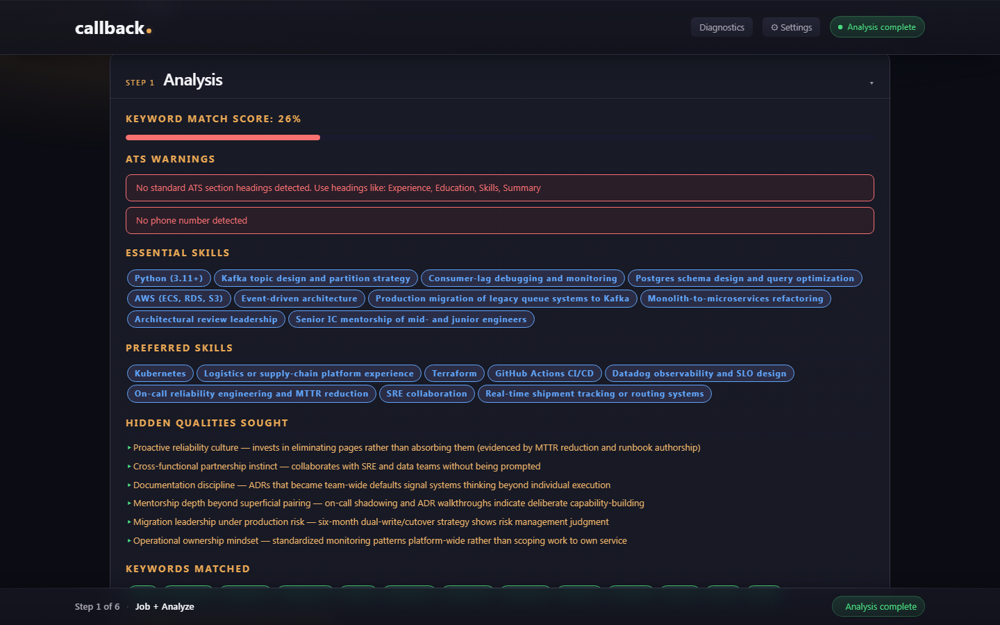

# callback. 

A local web application that tailors résumés and cover letters to specific job descriptions (JDs) using the Claude AI API. Built on the [10 Principles](https://jdforsythe.github.io/10-principles/overview/) — deterministic Python tools handle all mechanical work; the LLM (large language model — Anthropic's Claude, in callback.'s case) handles analysis and writing.

**callback. runs on your machine.** Every LLM call hits Anthropic's API directly — there's no callback.-operated proxy, so your Anthropic billing reflects your real usage, not a markup.

> **Doc map:** [`vision.md`](vision.md) (intent + constraints) ·
> [`docs/install.md`](docs/install.md) (install + first-run) ·
> [`docs/walkthrough.md`](docs/walkthrough.md) (screen-by-screen guide + flow diagrams) ·
> [`docs/architecture.md`](docs/architecture.md) (system + module map) ·
> [`AGENTS.md`](AGENTS.md) (AI-agent contract) ·
> [`CLAUDE.md`](CLAUDE.md) (Claude-specific overrides) ·
> [`CONTRIBUTING.md`](CONTRIBUTING.md) (PR workflow) ·
> [`SECURITY.md`](SECURITY.md) (threat model) ·
> [`docs/PRODUCT_SHAPE.md`](docs/PRODUCT_SHAPE.md) (v1 → v2 ladder) ·
> [`docs/RELEASE_CHECKLIST.md`](docs/RELEASE_CHECKLIST.md) (active release gates).
> Each doc opens with a `Purpose / Audience / Authoritative for` block.

---

## Requirements

- Python 3.10 or higher
- An [Anthropic API key](https://console.anthropic.com/)
- Internet connection (for API calls and optional LinkedIn/portfolio scraping)

---

## Installation

Quick install (Python 3.10+):

```bash
git clone https://github.com/amodal1/callback
cd callback
pip install -e .
python -m playwright install chromium       # one-time, ~150 MB, for PDF output
export ANTHROPIC_API_KEY=your-key-here       # or put it in a `.api_key` file
python app.py
```

Then open `http://localhost:5000` in your browser.

**Full step-by-step instructions** for Windows, macOS, and Linux —
including troubleshooting and a first-run walkthrough — live in
[`docs/install.md`](docs/install.md).

---

## What gets saved on your machine

callback. is local-first: **nothing leaves your computer** except
the API calls to Anthropic (and the LinkedIn/portfolio scrape if
you opt in). Everything else stays on disk under the repo root:

| Path                            | What it holds                                                                  | Gitignored |
|---------------------------------|--------------------------------------------------------------------------------|:---:|
| `configs/<user>.config`         | One file per user: name, email, phone, LinkedIn URL, settings, prefs           | ✓ |
| `resumes/<user>/`               | Uploaded .docx / .pdf / .md résumés you imported into the corpus               | ✓ |
| `output/<user>/`                | Generated résumés, cover letters, and the JSON `context_set` per iteration     | ✓ |
| `db/resume.sqlite`              | The structured career corpus (experiences, bullets, summaries, applications)   | ✓ |
| `logs/llm_calls.jsonl`          | One JSON line per Anthropic call (model, tokens, latency, cost) for observability | ✓ |
| `personas/owned/<user>/`        | Custom `.docx` templates you upload via the Template step                      | ✓ |
| `evals/results/*.jsonl`         | Eval harness scores; only present if you run `python evals/runner.py`          | ✓ |

The `.gitignore` keeps all of these out of source control. The
[`SECURITY.md`](SECURITY.md) doc has the full threat model.

---

<a name="cost"></a>
## Cost guidance

Per-application API cost in typical use:

- **Résumé only, no iteration, no clarify** — ~**$0.05 – $0.10**
- **Résumé + clarify + 1-2 refine iterations** — ~**$0.15 – $0.25**
- **Full loop with iterate-clarify + multiple refines + cover letter** — ~**$0.30 – $0.50**

Empirical numbers from your own usage live in
`logs/llm_calls.jsonl` (each line has `input_tokens`,
`cache_read_input_tokens`, `output_tokens`); the
[`/_dashboard`](http://localhost:5000/_dashboard) view aggregates
them while the app is running.

To cap spending, set a usage budget in your
[Anthropic Console](https://console.anthropic.com/settings/limits) —
callback. has no built-in spending guard.

---

## Getting an API key

Sign in at [console.anthropic.com](https://console.anthropic.com/), navigate to **API Keys → Create Key**, copy the key. Set it in `ANTHROPIC_API_KEY` or drop it into a `.api_key` file at the repo root (gitignored). Cap your spend via [Anthropic's usage limits](https://console.anthropic.com/settings/limits) — callback. has no built-in budget guard.

---

## The wizard at a glance

Your **corpus** is the pool of every bullet, summary, and experience you've ever written — callback. mines it for what fits this specific JD. You import it once and reuse it across every application.

A single application moves through six steps. The first three are corpus + analysis (cheap or free). The last three produce + refine + download the output (each generate is ~$0.05–$0.30; see [Cost guidance](#cost) for the full breakdown).

```
1. Job + Analyze    — paste the job description (JD), run analyze; the LLM reports
                      skill match + ATS (applicant tracking system) warnings
2. Clarify (opt)    — answer 3-5 questions surfacing real-but-undocumented experience
3. Compose          — pin / exclude / add bullets; pick the summary variant
4. Template         — pick one of 4 ATS-safe templates (live paginated preview)
5. Generate         — produce the tailored résumé (.docx, .pdf, or .md)
6. Download         — review, refine via natural-language instructions, download
                      Optional: + Generate cover letter against the finalized résumé
```



### The two human review gates

callback. pauses for your judgement at two points: the post-analyze review (step 1 → 2, where you decide whether to enter Clarify or skip ahead) and the post-generation refinement (step 6, where you read the generated résumé and either refine via natural-language note or approve). Clarification interviews between them are optional but cheap.

**For a screen-by-screen walkthrough** with user-flow + information-flow diagrams and what's happening under the hood at each step, see [`docs/walkthrough.md`](docs/walkthrough.md). For install steps, see [`docs/install.md`](docs/install.md). For the code shape, see [`docs/architecture.md`](docs/architecture.md).

---

## Privacy

The only network calls callback. makes are (a) to Anthropic's Claude API on each LLM call, and (b) the optional LinkedIn / portfolio URL scrape if you opt in. Anthropic's [privacy policy](https://www.anthropic.com/privacy) applies to API calls; nothing else leaves your machine. Full threat model in [`SECURITY.md`](SECURITY.md).

---

## Troubleshooting

Common issues — stale UI after restart, `ModuleNotFoundError`, missing Chromium binary, API key not picked up, port-5000 conflicts — are covered in [`docs/install.md#troubleshooting`](docs/install.md#troubleshooting).

---

## Claude Code Plugin

The project ships a Claude Code plugin under [.claude-plugin/](.claude-plugin/) — slash commands, subagents, and hooks that automate the dev workflow. Activation via `.claude/settings.json` (no install step required).

### Commands

| Command | What it does |
|---|---|
| [`/eval`](.claude-plugin/commands/eval.md) | Run the eval harness against synthetic or real fixtures |
| [`/replay`](.claude-plugin/commands/replay.md) | Re-run `generate()` on a saved `context_*.json` |
| [`/prompt-tune`](.claude-plugin/commands/prompt-tune.md) | A/B test a `SYSTEM_PROMPT` edit against the eval suite |
| [`/bench`](.claude-plugin/commands/bench.md) | Aggregate `logs/llm_calls.jsonl` for cache hit rate, latency, cost |
| [`/inspect-context`](.claude-plugin/commands/inspect-context.md) | Pretty-print + schema-validate a saved `context_set` |

### Subagents

| Agent | When to invoke |
|---|---|
| [`eval-judge`](.claude-plugin/agents/eval-judge.md) | Grade one (artifact × rubric) → JSON verdict |
| [`prompt-archaeologist`](.claude-plugin/agents/prompt-archaeologist.md) | Trace an eval failure to a prompt rule and propose a unified-diff fix |
| [`git-flow`](.claude-plugin/agents/git-flow.md) | Execute git workflow under the project's conventions |
| [`ux-onboarding-designer`](.claude-plugin/agents/ux-onboarding-designer.md) | Audit user-facing docs from a first-time-user lens → structured rewrite ladder |

### Hooks

Deterministic gates that fire automatically on tool use. See [.claude-plugin/hooks/](.claude-plugin/hooks/):

- `block-secrets` — blocks API keys + writes to `.api_key`/`.env*`/`*.pem`/`*.key`
- `ruff-changed` — runs `ruff check` on staged Python before `git commit`
- `block-merge-to-main` — blocks merge/push to main without explicit `CLAUDE_CONFIRM_MERGE=1`
- `validate-context` — JSON-syntax + schema check on `output/**/context_*.json` writes
- `route-security-lint` — requires `_safe_username` + `_within` on new Flask routes
- `check-plan-approved` / `mark-plan-approved` / `cleanup-plan-on-merge` — plan-mode workflow

### Dashboard

While the app is running, navigate to [http://localhost:5000/_dashboard](http://localhost:5000/_dashboard) for a read-only view of LLM telemetry: per-call token counts, latency, cache hit ratio, and the eval-harness verdicts. Localhost-only.
