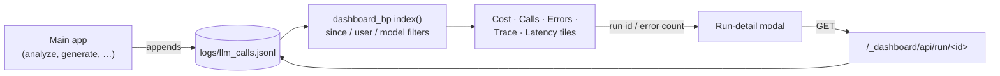
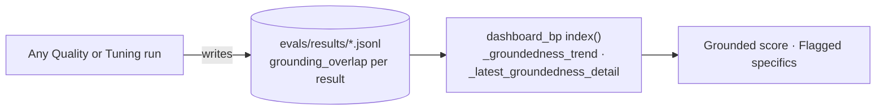
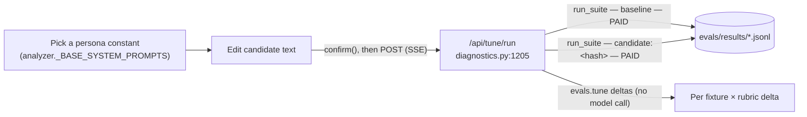
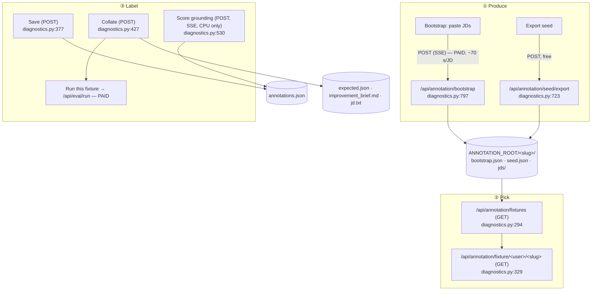

# The diagnostics console — per-tab reference

> **Purpose:** what each tab of the diagnostics console (`/_dashboard`) reads, which routes
> it calls, what costs money, and what it writes to disk. Each tab has a flow diagram and a
> control table, keyed to the on-screen help the console shows.
> **Audience:** `dev` — contributors changing the console, its routes or the eval tooling
> behind it. The console is a developer surface: it runs only on `localhost`.
> **Authoritative for:** the tab → route → data mapping. The on-screen copy lives once, in
> `dashboard/templates/dashboard.html` (`_DASH_HELP`, `:1283-1771`); the tables below name
> the `_DASH_HELP` key for each control instead of copying its text. The eval harness itself
> is documented in [`evals/README.md`](../../evals/README.md).

## How the console is put together

Two blueprints serve it:

- **`dashboard_bp`** ([`dashboard/routes.py`](../../dashboard/routes.py)) is mounted at
  `/_dashboard` (`app.py:49`).
  - `index()` (`:1026`) renders the whole page server-side.
  - `run_detail()` (`:1101`) serves `GET /_dashboard/api/run/<run_id>`.
  - A `before_request` localhost guard (`:1000-1001`) covers both.
  - Every read is a file read: the LLM call log `logs/llm_calls.jsonl` (`:54`), the eval
    results `evals/results/*.jsonl` (`:55`, `:118`), and the baseline
    `evals/results/baseline_v1.json` (`:913`).
- **`diagnostics_bp`** ([`blueprints/diagnostics.py`](../../blueprints/diagnostics.py)) is
  registered without a prefix (`app.py:76`). It serves every route that costs money or
  writes a file. Each route checks `_is_localhost_request()` itself and returns 403
  otherwise. Paid work goes through `evals.runner.run_suite` in a worker thread and streams
  progress back as server-sent events.
  - The four SSE run routes (eval, tune, bootstrap, score grounding) share one
    process-wide single-flight slot (`_single_flight_sse`, `:77`). A second run while one
    is live gets **409** `A diagnostics run is already in progress.`, from any tab or
    `curl`. The worker frees the slot when the work ends, not when the connection drops
    (item 117).

Page-wide pieces that belong to no single tab:

- **The run lock** (`dashboard.html:2183-2230`, `window.sartorRunLock`).
  - While a paid or CPU-heavy run is live, it disables the six run buttons in
    `LOCK_BTN_IDS`, shows `#runLockBanner` and warns before the page unloads.
  - It is the in-tab half; the server's single-flight slot above is the cross-tab half.
  - `acquire()` returns an owner token, or `null` when a run is already live.
    `release(token)` frees the lock only for its owner, so a stale or declined caller's
    cleanup can't free a live run (item 119).
  - Every run handler acquires **before** marking its button pending, and bails on
    `null` (item 120). The handlers are the shared eval runner (`:2354`), Tuning
    (`:2494`), bootstrap (`:2902`) and grounding-score (`:2979`).
- **The run-detail modal** (`#runDetailModal`) opens from a run id or error count on the
  Pipeline tab and fetches `/_dashboard/api/run/<id>` (`:2120`).
- **The assistant** (`#assistantModal`) is the same documentation assistant the main app
  has; see [architecture](architecture.md).
- **Help.** Every tab intro and most fields carry an (i) button. Its `data-help` key indexes
  `_DASH_HELP`, and the first visit to a tab opens that tab's entry once (`_DASH_HELP_ID`,
  `:1783`).

Paid calls are marked **PAID** below. The cost figures are the ones the console's own
`confirm()` dialogs show; this page doesn't restate them.

---

## Pipeline

Live telemetry for every LLM call the app makes. Help key: `dashPipeline`.

| Control | Route (`path:line`) | Paid? | Run lock? | `_DASH_HELP` key |
|---|---|---|---|---|
| Since / user / model filter form | `GET /_dashboard/` (`dashboard/routes.py:1026`) | no | no | `dashFilters` |
| Cost, calls, errors, trace, latency tiles | rendered by `index()` | no | no | `dashTileCost`, `dashTileCalls`, `dashTileErrors`, `dashTileTrace`, `dashTileLatency`, `dashPercentiles` |
| Run id / error count → run detail | `GET /_dashboard/api/run/<run_id>` (`dashboard/routes.py:1101`) | no | no | — |

The tab is read-only and stays empty until the main app has made at least one call. Eval
runs log their calls under the user `eval:<fixture>` (`evals/runner.py:812`), so setting the
user filter to that value isolates eval traffic. A Since value with no time zone,
including a bare date, is read as UTC, and so is a log timestamp without one. Both sides
of the comparison are offset-aware (`_parse_date`, item 112).

---

## Quality

Rubric grades (0–5) for generated résumés. Help key: `dashQuality`.

| Control | Route (`path:line`) | Paid? | Run lock? | `_DASH_HELP` key |
|---|---|---|---|---|
| Suite / Subset / grounding-signals fields | — (inputs to Run eval) | — | — | `dashSuiteField`, `dashSubsetField`, `dashGroundingSignals` |
| Run eval | `POST /api/eval/run` (`blueprints/diagnostics.py:1038`) | **PAID** (`confirm()` at `dashboard.html:2408`) | yes, token checked (`:2354`) | `dashEvalRun` |
| Tiles | rendered by `index()` over every eval result | no | no | `dashTileHealth`, `dashTilePassRate`, `dashTileScoreTrend`, `dashTileHeatmap`, `dashTileFailureModes`, `dashTilePareto`, `dashTileRecent` |

Health against the baseline has three bands (`dashboard/routes.py:923-933`):
- **regressed:** delta below −0.5, the merge-block gate;
- **watch:** delta from −0.5 up to −0.3;
- **ok:** delta of −0.3 or above.

The overall badge shows the worst band present. A run started from the command line
(`python evals/runner.py …`) lands in the same results directory, so it shows here too. The page reloads when a console run finishes (`:2411`).

---

## Groundedness

The deterministic no-invention metric, read back from eval results. Help key:
`dashGroundedness`.

| Control | Route (`path:line`) | Paid? | Run lock? | `_DASH_HELP` key |
|---|---|---|---|---|
| Grounded-score and flagged-specifics tiles | rendered by `index()` (`dashboard/routes.py:1050-1051`) | no | no | `dashTileGroundedScore`, `dashTileFlagged` |

The tab has no controls of its own; it fills in from Quality runs. The metric is
rule-based, with no model call at scoring time. What it measures and its known limits are
in [`GROUNDING_METRIC.md`](GROUNDING_METRIC.md).

---

## Tuning

A candidate-vs-baseline A/B of one system-prompt constant, using the prompt-override
primitive. Help key: `dashTuning`.

| Control | Route (`path:line`) | Paid? | Run lock? | `_DASH_HELP` key |
|---|---|---|---|---|
| Constant picker / candidate editor | — (inputs) | — | — | `dashTuneConstant`, `dashTuneCandidate` |
| Real-corpus seed (optional) | — (input) | — | — | `dashTuneSeed` |
| Run A/B | `POST /api/tune/run` (`blueprints/diagnostics.py:1205`) | **PAID**, two suites (`confirm()` at `dashboard.html:2491`) | yes, token checked (`:2494`) | `dashTuneRun` |
| Tuning-loop and baseline tiles | rendered by `index()` | no | no | `dashTileTuningLoop`, `dashTileBaseline` |

The candidate run stamps `prompt_version=candidate:<hash>`, so it never enters
score-over-time. Promotion is manual: nothing here edits `analyzer.py`. The console's cost
copy for this tab disagrees with the Quality tab's (item 134).

---

## Annotate

Produces and labels the `annotations.json` ground truth for grounding calibration.
Read-write, localhost-only. Help key: `dashAnnotate`. Everything it writes lands under
`ANNOTATION_ROOT` (`evals/fixtures/real/`, gitignored), per fixture slug, through
`_safe_username` + `_within` containment.

| Control | Route (`path:line`) | Paid? | Run lock? | `_DASH_HELP` key |
|---|---|---|---|---|
| ① Bootstrap | `POST /api/annotation/bootstrap` (`blueprints/diagnostics.py:797`) | **PAID**, no `confirm()` | yes, token checked (`dashboard.html:2902`) | `dashBootstrapRun`, `dashFixtureSlug` |
| ① Export seed | `POST /api/annotation/seed/export` (`:723`) | no | no | — |
| ② Fixture picker | `GET /api/annotation/fixtures` (`:294`), `GET /api/annotation/fixture/<user>/<slug>` (`:329`) | no | no | `dashFixturePicker` |
| ③ Verdict fields | — (in-browser; drafts auto-saved to `localStorage`) | — | — | `dashVerdicts`, `dashAnnFields` |
| ③ Save | `POST /api/annotation/fixture/<user>/<slug>` (`:377`) | no | no | — |
| ③ Collate | `POST …/collate` (`:427`) | no | governed button | `dashCollate` |
| ③ Score grounding | `POST …/score` (`:530`) | no (CPU scorers; needs the `[eval-grounding]` extras) | yes, token checked (`dashboard.html:2979`) | `dashAnnScore` |
| ③ Run this fixture (built after Collate) | `POST /api/eval/run` with `suite: "real"` | **PAID** (`confirm()` at `dashboard.html:2846`) | yes, via the shared runner | `dashCollateRun` |

Save validates with the same fail-closed contract the CLI uses
(`evals.annotation.validate_annotations`), so an incomplete doc is rejected rather than
written. Collate is deterministic and makes no model call.

---

## When the console changes

- A new tab or control gets a `_DASH_HELP` entry first, with a `learnMore` target: this
  page's slug and the tab's section, such as `dev-diagnostics#quality`.
  `tests/test_help_learn_more.py` fails on an entry without one, or on a target that
  doesn't resolve. Then add the control to the tab's table here, with its route and whether
  it is paid or locked.
- A new paid route belongs on `diagnostics_bp`, with the localhost check, and returns
  through `_single_flight_sse` so it shares the server's run slot. Its worker calls
  `free_slot()` in its `finally`. The button needs a `confirm()` plus a run-lock
  `acquire()` taken before any pending state, with its token kept for `release(token)`.
- The diagrams here are hand-written Mermaid. The docs-site workflow checks that each one
  renders (`scripts/check_docs_site_mermaid.py`). Mermaid ends a statement at `;`, so keep
  semicolons out of message and branch labels.
