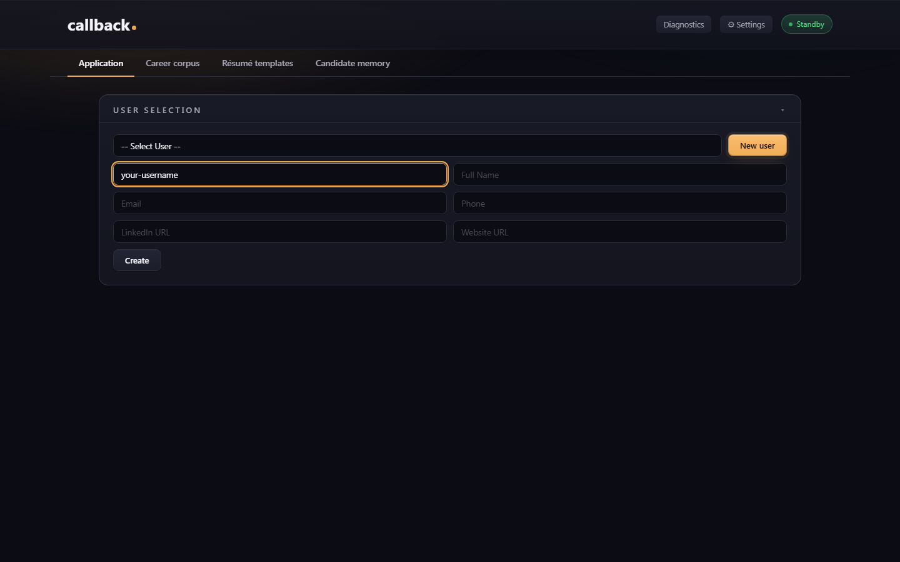

# Installing sartor.

> **Purpose:** end-to-end install guide for users on Windows, macOS,
> or Linux. The minimum-friction path to a running app + first
> generated résumé.
> **Audience:** humans installing sartor. for the first time.
> **Authoritative for:** OS-specific install steps, the Playwright
> Chromium download step, what gets downloaded & why, API-key setup,
> troubleshooting.
> Sibling docs:
> [`README.md`](../README.md) (overview),
> [`docs/walkthrough.md`](walkthrough.md) (screen-by-screen guide + flow diagrams),
> [`SECURITY.md`](../SECURITY.md) (what stays on your machine),
> [`docs/architecture.md`](architecture.md) (developer view).

---

## Prerequisites

- **Python 3.10 or newer.** Verify with `python --version` (or
  `python3 --version` on macOS/Linux).
- **An Anthropic API key.** Get one at
  [console.anthropic.com](https://console.anthropic.com/). See
  [Cost guidance](../README.md#cost) for the per-application
  breakdown; budget guards are documented in
  [`SECURITY.md`](../SECURITY.md).
- **A modern browser** (Chrome / Edge / Firefox / Safari).
  sartor. runs as a local Flask app you access in your browser.

**Optional — only if you want PDF output:** **~150 MB of free disk space** for
the Chromium binary Playwright downloads (`python -m playwright install
chromium`). DOCX, Markdown, and the live in-browser preview don't need it — so
if PDF isn't a priority you can skip this step and add it later. The binary
lives in your OS user cache (`%LOCALAPPDATA%\ms-playwright` on Windows,
`~/.cache/ms-playwright` on Linux, `~/Library/Caches/ms-playwright` on macOS) —
**outside** the repo, not committed.

---

## Run in a container (Docker or Podman)

The container is the lowest-friction path — Chromium (PDF) and the semantic-recall
index are **baked into the image**, so you need nothing but an API key. The same
image runs under Docker or Podman:

```bash
# Docker
docker run -e ANTHROPIC_API_KEY=your-key-here -p 127.0.0.1:5000:5000 \
  ghcr.io/take-tempo-public/sartor
# Podman (identical)
podman run -e ANTHROPIC_API_KEY=your-key-here -p 127.0.0.1:5000:5000 \
  ghcr.io/take-tempo-public/sartor
```

`-p 127.0.0.1:5000:5000` keeps Sartor loopback-only on your machine (the app binds
`0.0.0.0` **inside** the container only). Open `http://localhost:5000`.

**Persisting your data.** Your corpus DB and generated files live under `/app`
inside the container; mount volumes to keep them across runs:

```bash
docker run -e ANTHROPIC_API_KEY=your-key-here -p 127.0.0.1:5000:5000 \
  -v sartor-db:/app/db -v sartor-configs:/app/configs \
  -v sartor-resumes:/app/resumes -v sartor-output:/app/output \
  -v sartor-personas:/app/personas \
  ghcr.io/take-tempo-public/sartor
```

(Mounting a fresh `/app/db` shadows the baked recall index; the assistant falls
back to its lexical tier, and `docker exec … sartor --setup` rebuilds it into the
volume if you want the semantic tier back.)

## First-run setup for a source install (`sartor --setup`)

If you installed from source, run the one-time bootstrap instead of the manual
Chromium step:

```bash
sartor --setup   # installs Chromium for PDF + builds the semantic-recall index
```

It is idempotent (safe to re-run) and prints what it's doing. `sartor --host` /
`--port` override the bind address; `sartor --no-browser` skips the auto-open.

## Maintainer: publishing (one-time `[HUMAN]` setup)

The repo ships two release workflows that fire on a version tag (`vX.Y.Z`):

- **`.github/workflows/docker.yml`** — builds + pushes the multi-arch image to
  `ghcr.io/take-tempo-public/sartor`. After the first push, link the GHCR package
  to the repo and set it public (repo → Packages).
- **`.github/workflows/release.yml`** — builds the wheel and publishes to PyPI via
  **Trusted Publishing** (OIDC, no stored token). One-time: on
  [pypi.org](https://pypi.org) → your project → *Publishing* → add a GitHub
  publisher (repo `take-tempo-public/sartor`, workflow `release.yml`, environment
  `pypi`). **This job is intentionally gated** until the wheel ships the app's data
  dirs (see the tracked packaging follow-up); until then use the container or a
  source install.

To cut a release: bump `version` in `pyproject.toml`, commit, then
`git tag vX.Y.Z && git push --tags`.

---

<a name="what-gets-downloaded"></a>
## What gets downloaded & why

A plain `pip install -e .` pulls the ordinary Python packages (Flask, the
Anthropic SDK, Pydantic, SQLAlchemy, …). A few things are fetched *outside*
pip — here's each one, what it's for, and where it lives.

**To run the app you need nothing heavy beyond pip** — just Python, the repo
clone, a modern browser, and your Anthropic API key (all under
[Prerequisites](#prerequisites) above). DOCX output, Markdown output, and the
live in-browser preview are all Chromium-free (the preview paginates in your own
browser).

**The one sizeable non-pip download is for PDF output: the Chromium browser
binary** (~150 MB, one-time, via `python -m playwright install chromium`). It
renders PDF files (the in-browser preview shares the same HTML/CSS template but
renders browser-side, so the PDF matches the preview). It lives in your OS user
cache (`%LOCALAPPDATA%\ms-playwright` on Windows, `~/.cache/ms-playwright` on
Linux, `~/Library/Caches/ms-playwright` on macOS) — **outside the repo**, never
committed. On Linux, Chromium may also need a few system libraries (`libnss3`,
`libatk1.0-0`, …); the Playwright installer tells you if any are missing. If you
never export PDF, you can skip it.

**Optional — the quality / grounding eval stack (most users never need this).**
sartor. ships an offline *eval harness* that grades whether the AI invented
anything. Turning on its grounding scorers downloads **~3.2 GB** of model
weights (a small NLI model plus a larger fact-checking model) on first use,
cached permanently after. This is a **developer / power-user** feature — it
runs only in the eval harness, **never** in the app you launch with
`python app.py`, and end users don't need it. If you do want to run it, the
exact steps (the hardware-specific `torch` install, the `[eval-grounding]`
extras, sizes, and licensing) live in
[`CONTRIBUTING.md` → "Grounding signal scorers"](../CONTRIBUTING.md#grounding-signal-scorers-optional-dev-only).

---

## Windows

1. **Install Python** from [python.org](https://www.python.org/downloads/).
   During install, check **"Add Python to PATH"**.

2. **Open a terminal** — press `Win + R`, type `cmd`, press Enter.
   (PowerShell users: open Windows Terminal or press `Win + X → Terminal`.
   All commands below work in both; see the API-key step for the
   PowerShell equivalent of `set`.)

3. **Clone the repo and navigate into it:**
   ```cmd
   git clone https://github.com/take-tempo-public/sartor C:\Dev\sartor
   cd C:\Dev\sartor
   ```

4. **Install dependencies:**
   ```cmd
   pip install -e .
   ```
   If `pip` is not found (common with Windows Store Python), use:
   ```cmd
   python -m pip install -e .
   ```

5. **Optional — only for PDF output:** download the Chromium binary (one-time,
   ~150 MB). Skip it if you only need DOCX/Markdown output and the in-browser
   preview; you can run this later when you want PDF.
   ```cmd
   python -m playwright install chromium
   ```

6. **Set your API key** (choose one):

   - **Environment variable (recommended):**
     ```cmd
     set ANTHROPIC_API_KEY=your-key-here
     ```
     PowerShell equivalent:
     ```powershell
     $env:ANTHROPIC_API_KEY = "your-key-here"
     ```
     Permanent (both shells): `Win + R` → `sysdm.cpl` → Advanced →
     Environment Variables → New under "User variables".
   - **Key file:** create a file named `.api_key` in the repo
     root containing only your key.

7. **Run the app:**
   ```cmd
   python app.py
   ```

8. **Open your browser** and visit `http://localhost:5000`.

---

## macOS

1. **Install Python** (if not already):
   ```bash
   brew install python
   ```
   Or download from [python.org](https://www.python.org/downloads/).

2. **Open Terminal** — `Cmd + Space`, type `Terminal`, Enter.

3. **Clone and enter the repo:**
   ```bash
   git clone https://github.com/take-tempo-public/sartor ~/sartor
   cd ~/sartor
   ```

4. **Install dependencies:**
   ```bash
   pip3 install -e .
   ```

5. **Optional — only for PDF output:** download Chromium (skip if you only need
   DOCX/Markdown output and the in-browser preview).
   ```bash
   python3 -m playwright install chromium
   ```

6. **Set your API key:**
   ```bash
   export ANTHROPIC_API_KEY=your-key-here
   ```
   Permanent: add that line to `~/.zshrc` (or `~/.bash_profile`)
   and `source ~/.zshrc`.

   Or create a `.api_key` file in the repo root:
   ```bash
   echo "your-key-here" > .api_key
   ```

7. **Run the app:**
   ```bash
   python3 app.py
   ```

8. **Open your browser** to `http://localhost:5000`.

---

## Linux

1. **Install Python** (most distros include it; verify):
   ```bash
   python3 --version
   ```
   If missing:
   ```bash
   # Ubuntu / Debian
   sudo apt install python3 python3-pip
   # Fedora / RHEL
   sudo dnf install python3 python3-pip
   # Arch
   sudo pacman -S python python-pip
   ```

2. **Clone and enter the repo:**
   ```bash
   git clone https://github.com/take-tempo-public/sartor ~/sartor
   cd ~/sartor
   ```

3. **Install dependencies:**
   ```bash
   pip3 install -e .
   ```

4. **Optional — only for PDF output:** download Chromium (skip if you only need
   DOCX/Markdown output and the in-browser preview).
   ```bash
   python3 -m playwright install chromium
   ```
   On some distros Playwright also needs system libraries. If the
   `chromium install` command warns about missing deps, follow its
   on-screen instructions (usually one `apt install` line). On
   Ubuntu 22.04+ the canonical fallback is:
   ```bash
   sudo apt install libnss3 libatk1.0-0 libatk-bridge2.0-0 \
                    libxkbcommon0 libxcomposite1 libxdamage1 \
                    libxfixes3 libxrandr2 libgbm1 libpango-1.0-0 \
                    libcairo2 libasound2
   ```

5. **Set your API key:**
   ```bash
   export ANTHROPIC_API_KEY=your-key-here
   ```
   Permanent: add to `~/.bashrc` or `~/.zshrc`.

6. **Run the app:**
   ```bash
   python3 app.py
   ```

7. **Open your browser** to `http://localhost:5000`.

---

## First-run walkthrough

By the end of these eight steps you'll have your first tailored
résumé sitting in `output/<your-user>/`. Total time: about 5
minutes plus one ~30–60s LLM analyze call. Total cost: ~$0.05–$0.30
([see breakdown](../README.md#cost)).

After the app is running:

1. **Select or create a user** in the top-right user picker.
   Each user has their own corpus, settings, and output history.

   

2. **Open the Career Corpus tab** and click `+ Import résumé` if
   you have an existing résumé file in `resumes/<user>/`. The
   importer extracts experiences and bullets into the structured
   corpus (uses one Haiku call, ~$0.02).
3. **Click the Application tab → Start application.**
4. Follow the six-step wizard:
   1. **Job description** — paste the JD text.
   2. **Clarify** *(optional)* — answer 3-5 LLM questions that
      surface real-but-undocumented experience.
   3. **Compose** — pin, exclude, or add bullets and pick which
      summary variant to use.
   4. **Template** — choose a layout; preview updates live.
   5. **Generate** — produce the résumé in DOCX, PDF, or Markdown.
   6. **Download** — review, refine, and download.
5. *(Optional)* Generate a cover letter against the finalized
   résumé using the **+ Generate cover letter** button.

For the full screen-by-screen guide — including user-flow and
information-flow diagrams, what each LLM call is actually doing,
and the two human review gates — read
[`docs/walkthrough.md`](walkthrough.md) next.

---

## Troubleshooting

**"I just shipped a UI change but the browser still shows the
old version."**
The app sends `Cache-Control: no-cache` on the HTML shell and
`max-age=0` on `/static/*`, so this shouldn't happen in normal
use. If it does: clear the browser cache for `localhost:5000`
(DevTools → Network → "Disable cache" while DevTools is open,
then reload). One-time fix.

**"Generation fails with 'AI generation response was malformed
after retry.'"**
Rare. The LLM occasionally emits raw control characters in its
JSON response — the parser tolerates the common case, but new
failure modes occasionally surface. If you hit this on current
`main`, file an issue with the `detail:` field attached.

**Anthropic API error mid-call (4xx, 5xx, or network drop during a 30–60s analyze or generate call).**
You'll see an error toast in the UI. Your `context_set` for that
iteration is already saved on disk, so nothing is lost — just
click the step's main action button again to retry. Common causes:
network blip (retry), rate-limit hit (wait a minute), invalid API
key (re-check `.api_key` or `$ANTHROPIC_API_KEY`), or your
Anthropic billing cap being exceeded (raise it in the
[Anthropic Console](https://console.anthropic.com/settings/limits)).
The `logs/llm_calls.jsonl` file records every attempt with the
status code, so you can see exactly which call failed.

**"Chromium not found" when trying to generate PDF.**
Run `python -m playwright install chromium` again. The Chromium
binary lives in your OS user cache, not the repo, so a fresh
clone needs the install step.

**"API key not picked up."**
Confirm one of:
- `echo $ANTHROPIC_API_KEY` (or `echo %ANTHROPIC_API_KEY%` on
  Windows) shows your key in the same shell where you launched
  `python app.py`.
- `.api_key` exists in the repo root and contains only the key,
  no quotes, no trailing newline.

**Port 5000 already in use.**
Another process is on `:5000`. On Windows: `netstat -ano | findstr :5000`
to find the PID, then `taskkill /PID <pid> /F`. On macOS/Linux:
`lsof -i :5000` then `kill <pid>`. Or change the port in
[`app.py`](../app.py) `main()` — search for `port=5000`.

**"My data is somewhere I can't find."**
See the "What gets saved on your machine" section in
[`README.md`](../README.md). The short answer: `configs/`,
`resumes/`, `output/`, `db/resume.sqlite`, `logs/` — all under
the repo root.

---

## Verifying the install

After the steps above:

```bash
python -m pytest -q
```

Should report `1200+ passed`. Then:

```bash
python -m ruff check .
```

Should report `All checks passed!`.

If either fails on a fresh clone, check the Python version and
re-run `pip install -e .` (a partial install can leave
dependencies out of sync).
