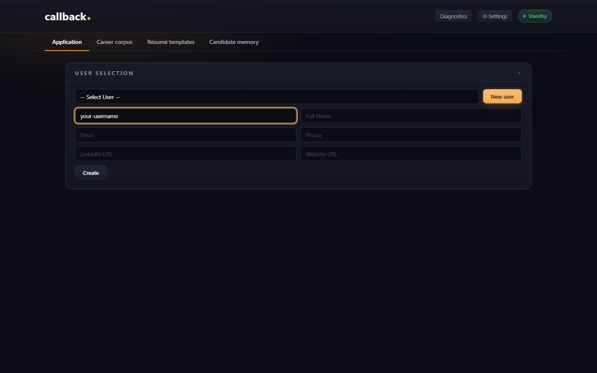

# Installing sartor.

> **Purpose:** end-to-end install guide for users on Windows, macOS,
> or Linux. The minimum-friction path to a running app + first
> generated résumé.
> **Audience:** humans installing Sartor for the first time.
> **Authoritative for:** OS-specific install steps, the Playwright
> Chromium download step, what gets downloaded & why, API-key setup,
> troubleshooting.
> Sibling docs:
> [`README.md`](../README.md) (overview),
> [`docs/walkthrough.md`](walkthrough.md) (screen-by-screen guide + flow diagrams),
> [`SECURITY.md`](../SECURITY.md) (what stays on your machine),
> [`docs/architecture.md`](architecture.md) (developer view).

---

## Prerequisites

- **Python 3.11 or newer.** Verify with `python --version` (or
  `python3 --version` on macOS/Linux).
- **An Anthropic API key.** Get one at
  [console.anthropic.com](https://console.anthropic.com/). See
  [Cost guidance](../README.md#install) for the per-application
  breakdown; budget guards are documented in
  [`SECURITY.md`](../SECURITY.md).
  You do **not** need one to try Sartor — see
  [demo mode](#try-it-without-an-api-key-demo-mode).
- **A modern browser** (Chrome / Edge / Firefox / Safari).
  Sartor runs as a local Flask app you access in your browser.

### Check your machine first: `sartor --doctor`

Once the code is installed (any path below), one command tells you what will
actually work here — Python version, OS, whether a key is found, whether PDF
output can render, whether the assistant's semantic tier is built:

```bash
sartor --doctor
```

It downloads nothing, changes nothing, and takes about a hundredth of a second.
Run it before `sartor --setup` if you want to know what you are in for. It exits
non-zero only when Python itself is below the floor; everything else it reports
is an optional feature, and Sartor runs without any of them.

### Version floors

Only floors this project has actually **hit and traced** are listed. Where a
row says *none measured*, that means exactly that — not "any version works".
`sartor --doctor` is the reliable answer for your specific machine.

| | Source install | Container |
|---|---|---|
| **Python** | 3.11+ | not needed (baked into the image) |
| **macOS** | none measured | **13+** — Podman's `applehv` VM backend requires it |
| **Windows** | none measured | none measured |
| **Linux** | none measured | none measured |
| **PDF output** | **macOS 13+**; no measured floor elsewhere | included in the image |

**The macOS 13 floor is not cosmetic, and it fails obscurely.** On macOS 12,
`podman machine start` reports `vfkit exited unexpectedly with exit code 1`;
the real cause (`unsupported macOS version`) appears only under
`--log-level=debug`. On the same machine, `python -m playwright install
chromium` also fails — current Playwright releases ship no Chromium build for
macOS 12 — so **PDF output is unavailable on macOS 12 regardless of install
method**. Sartor still runs: DOCX, Markdown, and the live in-browser preview
need no Chromium, and the app hides the PDF option when it cannot render one.

**Optional — only if you want PDF output:** **~150 MB of free disk space** for
the Chromium binary Playwright downloads (`python -m playwright install
chromium`). DOCX, Markdown, and the live in-browser preview don't need it — so
if PDF isn't a priority you can skip this step and add it later. The binary
lives in your OS user cache (`%LOCALAPPDATA%\ms-playwright` on Windows,
`~/.cache/ms-playwright` on Linux, `~/Library/Caches/ms-playwright` on macOS) —
**outside** the repo, not committed.

**A note on `pip install --user` (macOS).** Console scripts installed that way
land in a directory that is not on the default macOS `PATH`, so `sartor` will
not be found even though the install succeeded. Either use a virtualenv, or
invoke it as `python3 -m app` / `python3 app.py` from the repo.

---

## Install from source (the path that works today)

> **Read this first.** The container image and the PyPI wheel described below
> are **not published yet** — no version tag has been pushed, so neither
> `ghcr.io/take-tempo-public/sartor` nor `pip install sartor` resolves to
> anything. Verified 2026-09-02: `git ls-remote --tags origin` returns nothing,
> `gh release list` is empty, and neither publish workflow has ever run. Both
> sections are kept because they describe the intended shape and the commands
> are correct once a release exists — but **today, the source clone is the
> install method**, not a developer footnote. Publication is tracked in
> [`docs/dev/work/items/0099-install-docs-document-unpublished-paths.md`](dev/work/items/0099-install-docs-document-unpublished-paths.md)
> and gated on the one-time maintainer setup below.

Jump to your platform: [Windows](#windows) · [macOS](#macos) · [Linux](#linux).
Then run `sartor --doctor` to confirm what your machine supports.

---

## Run in a container (Docker or Podman) — *not yet published*

> **This image does not exist yet.** `docker pull` / `podman pull` on the tag
> below fails with a manifest error. The commands are documented so they are
> ready and reviewed when the first tag ships; until then use the
> [source install](#install-from-source-the-path-that-works-today).

Once published, the container is the lowest-friction path — Chromium (PDF) and
the semantic-recall index are **baked into the image**, so you need nothing but
an API key. The same image runs under Docker or Podman.

### The command to use

Name the container and mount volumes from the start:

```bash
podman run --name sartor -p 127.0.0.1:5000:5000 \
  -e ANTHROPIC_API_KEY=your-key-here \
  -v sartor-db:/app/db -v sartor-configs:/app/configs \
  -v sartor-resumes:/app/resumes -v sartor-output:/app/output \
  -v sartor-personas:/app/personas \
  ghcr.io/take-tempo-public/sartor
```

(`docker run` is identical — substitute the command name.)

`-p 127.0.0.1:5000:5000` keeps Sartor loopback-only on your machine (the app
binds `0.0.0.0` **inside** the container only). Open `http://localhost:5000`.

**Restart the same container later — do not `run` again:**

```bash
podman start -a sartor      # resume the named container
podman ps -a                # list containers, including stopped ones
```

### Why the short form is not the default

A bare `podman run … ghcr.io/take-tempo-public/sartor` with no `-v` and no
`--name` **discards your work.** The `Dockerfile` declares no `VOLUME`, so
everything written under `/app` lands in that container's writable layer. It
survives `stop` → `start` of the *same* container, but a second `run` creates a
*new* container with an empty layer — and with no `--name`, the first one is an
unnamed row in `podman ps -a` you have no reason to connect to your corpus.

Use the bare form only for a genuinely throwaway look:

```bash
podman run --rm -p 127.0.0.1:5000:5000 \
  -e ANTHROPIC_API_KEY=your-key-here ghcr.io/take-tempo-public/sartor
```

`--rm` is deliberate there: it makes the discard explicit instead of leaving an
orphan holding data you might later assume was saved.

### Named volumes, not bind mounts, for `/app/db` and `/app/personas`

**This distinction is load-bearing, and getting it wrong stops the app booting.**

- `db/` is **not** a data directory. It is a Python package inside the image —
  `__init__.py`, `models.py`, `session.py`, `migrations/` — plus the recall
  index built at image-build time. A host **bind mount** over `/app/db` shadows
  that package, and the app fails at startup on `import db`.
- `personas/bundled/` ships in the image too (`.dockerignore` keeps it with
  `!personas/bundled/`), so the same applies to `/app/personas`.
- **Named volumes are safe for both** — an empty named volume is populated from
  the image's existing contents on first use, which is why the command above
  works.
- **Only `output/`, `configs/` and `resumes/` are safe to bind-mount.** Those
  three are excluded from the image, so there is nothing to shadow.

If you reach for the `-v /some/host/path:/app/db` form because it is the one you
know, that is the trap this section exists to name.

### Getting files onto the host

For a document or two, **you do not need a mount at all** — download from the
app in your browser exactly as you would from any web page. That is the right
answer for one-off retrieval and skips the volume question entirely.

For bulk access to everything generated, bind-mount the one directory that is
safe to bind-mount:

```bash
podman run --name sartor -p 127.0.0.1:5000:5000 \
  -e ANTHROPIC_API_KEY=your-key-here \
  -v sartor-db:/app/db -v "$PWD/output:/app/output" \
  ghcr.io/take-tempo-public/sartor
```

**Two things here are unverified, and are stated rather than asserted.** Neither
can be settled without a container run on supported hardware, and the image has
never been published, so nothing has been run:

1. Under **rootless Podman**, a host bind mount may not be writable by the
   container's uid (10001, per the `Dockerfile`) without
   `--userns=keep-id:uid=10001,gid=10001`. This is reasoned from the image
   definition, not observed.
2. An earlier version of this page stated that mounting a fresh `/app/db`
   shadows the baked recall index, degrading the assistant to its lexical tier
   until `sartor --setup` is re-run. Named-volume copy-up semantics suggest that
   is **wrong for a named volume** — which is the form recommended above. The
   claim has been removed rather than restated, because it was never verified in
   either direction. If you do see the assistant fall back to lexical search
   after a fresh mount, `podman exec sartor sartor --setup` rebuilds the index
   into the volume.

## First-run setup for a source install (`sartor --setup`)

If you installed from source, run the one-time bootstrap instead of the manual
Chromium step:

```bash
sartor --setup   # prompts for your API key, installs Chromium, builds the recall index
```

It does three things, in this order:

1. **Asks for your API key without echoing it**, if no key is already found, and
   writes `.api_key` itself with owner-only permissions. This is the recommended
   way to supply the key — see [API key](#api-key-keep-it-out-of-your-shell-history)
   below for why. It runs first so that a keyless install finds out immediately
   rather than after ~180 MB of downloads. Press Enter to skip.
2. Installs the Chromium binary for PDF output (~150 MB, one-time).
3. Builds the assistant's semantic-recall index (~30 MB model, one-time).

It is idempotent (safe to re-run) and prints what it's doing. If a step fails it
says **which feature** is degraded and which still works, and Sartor runs either
way. It never re-prompts for a key you already have, and it never prompts at all
when stdin is not a terminal (a container build or CI step), so it cannot hang.

`sartor --doctor` reports the same capabilities without changing anything.
`sartor --host` / `--port` override the bind address; `sartor --no-browser`
skips the auto-open.

### API key: keep it out of your shell history

Every obvious way to supply the key writes it into your shell history in
plaintext — `export ANTHROPIC_API_KEY=…`, `docker run -e ANTHROPIC_API_KEY=…`,
and `echo … > .api_key` alike. History files persist, sync, and get backed up.

**Prefer `sartor --setup`**: it reads the key without echoing and writes
`.api_key` with owner-only permissions, so the key never appears in a command
line at all.

If you have already typed a key into a shell and want it gone, note the ordering
trap: closing the terminal re-flushes the in-memory history over the file you
just cleaned, so **`unset HISTFILE` first**, then edit the history file, then
close the terminal. If the key reached a machine you do not control, rotate it
in the [Anthropic Console](https://console.anthropic.com/) — scrubbing history
is damage control, not a fix.

### Local development: headless / container / CI runs (F-18)

The bare `sartor` / `python app.py` happy path is tuned for a local desktop:
it auto-opens your browser and runs with Flask's debug reloader on (verbose
error pages, live-reload). Two env vars turn each off explicitly:

| Var | Effect when `1` |
|---|---|
| `SARTOR_NO_BROWSER` | skip the auto-open (same as `sartor --no-browser`) |
| `FLASK_DEBUG=0` | disable the reloader + verbose error pages |

**You usually don't need to set these by hand.** If neither is set, `sartor`
auto-detects a CI runner (the `CI` env var most CI providers set) or a
container (`/.dockerenv`) and defaults both off in that case — a bare
`python app.py` in a CI smoke step, devcontainer, or Codespace no longer hangs
on a browser open or prints a debug traceback by surprise. Setting either var
explicitly always wins over the auto-detection. The shipped `Dockerfile`
already sets both explicitly (see "Run in a container" above), so this only
matters for an ad-hoc run outside that image.

## Try it without an API key (demo mode)

Set `SARTOR_DEMO=1` to run without any Anthropic key — every AI step returns a
canned, deterministic response instead of calling the API, so you can walk the
full analyze → compose → generate flow with zero spend before deciding to get
a key:

```bash
SARTOR_DEMO=1 sartor                       # macOS / Linux
```

```powershell
$env:SARTOR_DEMO = "1"; sartor             # Windows PowerShell
```

What to expect:

- A persistent banner — "Demo mode — canned AI responses, no API calls" — at
  the top of every page while the flag is set.
- The canned outputs tell one coherent story (an SRE candidate against an SRE
  job posting, adapted from the project's synthetic eval fixtures); they are
  **not** tailored to what you paste in.
- No telemetry: demo runs never write to `logs/llm_calls.jsonl`, so the
  diagnostics dashboard's cost/latency numbers stay real.
- Demo mode never turns on by itself — a missing key without the flag still
  produces the normal explicit error at the first AI call. And if a real key
  *is* present alongside the flag, demo still wins: nothing spends.

Unset the variable and restart to switch back to real AI calls.

## Maintainer: publishing (one-time `[HUMAN]` setup)

> **Status, verified 2026-09-02: nothing has been published.**
> `git ls-remote --tags origin` returns no tags (all local tags `v0.2.0`–`v1.0.9`
> exist only in the maintainer's clone), `gh release list` is empty, and neither
> workflow below has ever run. Until step 5 happens, the container and PyPI
> sections above describe an intended future state, and the source clone is the
> only working install.

Two workflows do the release automatically on a version tag (`vX.Y.Z`):
[`docker.yml`](../.github/workflows/docker.yml) builds + pushes the multi-arch
image to `ghcr.io/take-tempo-public/sartor`; [`release.yml`](../.github/workflows/release.yml)
builds the wheel and publishes to PyPI via **Trusted Publishing** (OIDC, no
stored token). A maintainer only does the console setup CI can't do, then pushes
the tag:

1. **GitHub** — create org + repo `take-tempo-public/sartor` (the image namespace,
   the PyPI publisher, and the in-app citation URLs all key off it).
2. **PyPI** — [pypi.org](https://pypi.org) → *Your account → Publishing* → add a
   pending publisher: project `sartor`, owner `take-tempo-public`, repo `sartor`,
   workflow `release.yml`, environment `pypi`. Then in the GitHub repo →
   *Settings → Environments* → create the `pypi` environment.
3. **GHCR** — after the first image push, set the package public and link it to the
   repo (org → Packages → package settings).
4. **Un-gate PyPI** — the `release.yml` publish job is intentionally gated (a `GATE`
   step) until the wheel ships the app's data dirs. Fix that packaging follow-up,
   verify a fresh-venv `pip install <wheel>` serves a page, then delete the `GATE`
   step. Until then, ship via the container or a source install.
5. **Each release (recurring)** — bump `version` in `pyproject.toml`, commit/merge,
   then `git tag vX.Y.Z && git push --tags`. The tag fires both workflows.

---

<a name="what-gets-downloaded"></a>
## What gets downloaded & why

A plain `pip install -e .` pulls the ordinary Python packages (Flask, the
Anthropic SDK, Pydantic, SQLAlchemy, …). A few things are fetched *outside*
pip — here's each one, what it's for, and where it lives.

**To run the app you need nothing heavy beyond pip** — just Python, the repo
clone, a modern browser, and your Anthropic API key (all under
[Prerequisites](#prerequisites) above). DOCX output, Markdown output, and the
live in-browser preview are all Chromium-free (the preview paginates in your own
browser).

**The one sizeable non-pip download is for PDF output: the Chromium browser
binary** (~150 MB, one-time, via `python -m playwright install chromium`). It
renders PDF files (the in-browser preview shares the same HTML/CSS template but
renders browser-side, so the PDF matches the preview). It lives in your OS user
cache (`%LOCALAPPDATA%\ms-playwright` on Windows, `~/.cache/ms-playwright` on
Linux, `~/Library/Caches/ms-playwright` on macOS) — **outside the repo**, never
committed. On Linux, Chromium may also need a few system libraries (`libnss3`,
`libatk1.0-0`, …); the Playwright installer tells you if any are missing. If you
never export PDF, you can skip it.

**Optional — the quality / grounding eval stack (most users never need this).**
Sartor ships an offline *eval harness* that grades whether the AI invented
anything. Turning on its grounding scorers downloads **~3.2 GB** of model
weights (a small NLI model plus a larger fact-checking model) on first use,
cached permanently after. This is a **developer / power-user** feature — it
runs only in the eval harness, **never** in the app you launch with
`python app.py`, and end users don't need it. If you do want to run it, the
exact steps (the hardware-specific `torch` install, the `[eval-grounding]`
extras, sizes, and licensing) live in
[`CONTRIBUTING.md` → "Grounding signal scorers"](../CONTRIBUTING.md#grounding-signal-scorers-optional-dev-only).

---

## Windows

1. **Install Python** from [python.org](https://www.python.org/downloads/).
   During install, check **"Add Python to PATH"**.

2. **Open a terminal** — press `Win + R`, type `cmd`, press Enter.
   (PowerShell users: open Windows Terminal or press `Win + X → Terminal`.
   All commands below work in both; see the API-key step for the
   PowerShell equivalent of `set`.)

3. **Clone the repo and navigate into it:**
   ```cmd
   git clone https://github.com/take-tempo-public/sartor
   cd sartor
   ```

4. **Install dependencies:**
   ```cmd
   pip install -e .
   ```
   If `pip` is not found (common with Windows Store Python), use:
   ```cmd
   python -m pip install -e .
   ```

5. **Optional — one-time setup for PDF output + the assistant's semantic
   search** (idempotent; safe to re-run; skip it if you only need
   DOCX/Markdown output and the in-browser preview — you can run this later):
   ```cmd
   sartor --setup
   ```
   This installs the Chromium binary (~150 MB, PDF output) and builds the
   doc-grounded assistant's semantic-recall index (~30 MB model, one-time).
   Without it: PDF export needs Chromium first, and the assistant falls back
   to its lexical/wiki search tiers until the index is built.

6. **Set your API key.**

   - **Recommended — let `--setup` prompt you** (step 5 above already did this
     if you ran it). It reads the key without echoing and writes `.api_key`
     itself, so the key never lands in your command history:
     ```cmd
     sartor --setup
     ```
   - **Environment variable** — convenient, but this line goes into your shell
     history in plaintext:
     ```cmd
     set ANTHROPIC_API_KEY=your-key-here
     ```
     PowerShell equivalent:
     ```powershell
     $env:ANTHROPIC_API_KEY = "your-key-here"
     ```
     Permanent (both shells): `Win + R` → `sysdm.cpl` → Advanced →
     Environment Variables → New under "User variables".
   - **Key file:** create a file named `.api_key` in the repo
     root containing only your key.

7. **Run the app:**
   ```cmd
   python app.py
   ```

8. **Open your browser** and visit `http://localhost:5000`.

---

## macOS

1. **Install Python** (if not already):
   ```bash
   brew install python
   ```
   Or download from [python.org](https://www.python.org/downloads/).

2. **Open Terminal** — `Cmd + Space`, type `Terminal`, Enter.

3. **Clone and enter the repo:**
   ```bash
   git clone https://github.com/take-tempo-public/sartor ~/sartor
   cd ~/sartor
   ```

4. **Install dependencies:**
   ```bash
   pip3 install -e .
   ```

5. **Optional — one-time setup for PDF output + the assistant's semantic
   search** (idempotent; safe to re-run; skip if you only need DOCX/Markdown
   output and the in-browser preview):
   ```bash
   sartor --setup
   ```
   This installs the Chromium binary (~150 MB, PDF output) and builds the
   doc-grounded assistant's semantic-recall index (~30 MB model, one-time).
   Without it: PDF export needs Chromium first, and the assistant falls back
   to its lexical/wiki search tiers until the index is built.

6. **Set your API key.**

   **Recommended** — `sartor --setup` (step 5) prompts for it without echoing
   and writes `.api_key` with owner-only permissions. Nothing reaches your
   history. If you skipped step 5, run it now:
   ```bash
   sartor --setup
   ```

   The alternatives below both put the key in `~/.zsh_history` in plaintext —
   see [API key](#api-key-keep-it-out-of-your-shell-history):
   ```bash
   export ANTHROPIC_API_KEY=your-key-here     # also add to ~/.zshrc to persist
   echo "your-key-here" > .api_key            # same exposure, via the echo line
   ```

7. **Run the app:**
   ```bash
   python3 app.py
   ```

8. **Open your browser** to `http://localhost:5000`.

---

## Linux

1. **Install Python** (most distros include it; verify):
   ```bash
   python3 --version
   ```
   If missing:
   ```bash
   # Ubuntu / Debian
   sudo apt install python3 python3-pip
   # Fedora / RHEL
   sudo dnf install python3 python3-pip
   # Arch
   sudo pacman -S python python-pip
   ```

2. **Clone and enter the repo:**
   ```bash
   git clone https://github.com/take-tempo-public/sartor ~/sartor
   cd ~/sartor
   ```

3. **Install dependencies:**
   ```bash
   pip3 install -e .
   ```

4. **Optional — one-time setup for PDF output + the assistant's semantic
   search** (idempotent; safe to re-run; skip if you only need DOCX/Markdown
   output and the in-browser preview):
   ```bash
   sartor --setup
   ```
   This installs the Chromium binary (~150 MB, PDF output) and builds the
   doc-grounded assistant's semantic-recall index (~30 MB model, one-time).
   Without it: PDF export needs Chromium first, and the assistant falls back
   to its lexical/wiki search tiers until the index is built.

   On some distros Playwright also needs system libraries. If the Chromium
   install step warns about missing deps, follow its on-screen instructions
   (usually one `apt install` line). On Ubuntu 22.04+ the canonical fallback
   is:
   ```bash
   sudo apt install libnss3 libatk1.0-0 libatk-bridge2.0-0 \
                    libxkbcommon0 libxcomposite1 libxdamage1 \
                    libxfixes3 libxrandr2 libgbm1 libpango-1.0-0 \
                    libcairo2 libasound2
   ```

5. **Set your API key.**

   **Recommended** — `sartor --setup` (step 4) prompts without echoing and
   writes `.api_key` itself. The environment-variable form below is written to
   your shell history in plaintext:
   ```bash
   export ANTHROPIC_API_KEY=your-key-here
   ```
   Permanent: add to `~/.bashrc` or `~/.zshrc`.

6. **Run the app:**
   ```bash
   python3 app.py
   ```

7. **Open your browser** to `http://localhost:5000`.

---

## First-run walkthrough

By the end of these eight steps you'll have your first tailored
résumé sitting in `output/<your-user>/`. Total time: about 5
minutes plus one ~30–60s LLM analyze call. Total cost: ~$0.05–$0.30
([see breakdown](../README.md#install)).

After the app is running:

1. **Select or create a user** in the top-right user picker.
   Each user has their own corpus, settings, and output history.

   

2. **Open the Career Corpus tab** and click `+ Import résumé` if
   you have an existing résumé file in `resumes/<user>/`. The
   importer extracts experiences and bullets into the structured
   corpus (uses one Haiku call, ~$0.02).
3. **Click the Application tab → Start application.**
4. Follow the six-step wizard:
   1. **Job description** — paste the JD text.
   2. **Clarify** *(optional)* — answer 3-5 LLM questions that
      surface real-but-undocumented experience.
   3. **Compose** — pin, exclude, or add bullets and pick which
      summary variant to use.
   4. **Template** — choose a layout; preview updates live.
   5. **Generate** — produce the résumé in DOCX, PDF, or Markdown.
   6. **Download** — review, refine, and download.
5. *(Optional)* Generate a cover letter against the finalized
   résumé using the **+ Generate cover letter** button.

For the full screen-by-screen guide — including user-flow and
information-flow diagrams, what each LLM call is actually doing,
and the two human review gates — read
[`docs/walkthrough.md`](walkthrough.md) next.

---

## Troubleshooting

**"I just shipped a UI change but the browser still shows the
old version."**
The app sends `Cache-Control: no-cache` on the HTML shell and
`max-age=0` on `/static/*`, so this shouldn't happen in normal
use. If it does: clear the browser cache for `localhost:5000`
(DevTools → Network → "Disable cache" while DevTools is open,
then reload). One-time fix.

**"Generation fails with 'AI generation response was malformed
after retry.'"**
Rare. The LLM occasionally emits raw control characters in its
JSON response — the parser tolerates the common case, but new
failure modes occasionally surface. If you hit this on current
`main`, file an issue with the `detail:` field attached.

**Anthropic API error mid-call (4xx, 5xx, or network drop during a 30–60s analyze or generate call).**
You'll see an error toast in the UI. Your `context_set` for that
iteration is already saved on disk, so nothing is lost — just
click the step's main action button again to retry. Common causes:
network blip (retry), rate-limit hit (wait a minute), invalid API
key (re-check `.api_key` or `$ANTHROPIC_API_KEY`), or your
Anthropic billing cap being exceeded (raise it in the
[Anthropic Console](https://console.anthropic.com/settings/limits)).
The `logs/llm_calls.jsonl` file records every attempt with the
status code, so you can see exactly which call failed.

**"Chromium not found" when trying to generate PDF, or the PDF button is greyed out.**
Run `sartor --doctor` first — it says whether Chromium is actually installed and
stops the guessing. The binary lives in your OS user cache, not the repo, so a
fresh clone needs the install step: `sartor --setup`, or
`python -m playwright install chromium`.

**On macOS 12 that command cannot succeed** — current Playwright releases ship no
Chromium build for it — so PDF output is unavailable there no matter how many
times you re-run the install. Sartor disables the PDF option rather than offering
one it cannot produce; use DOCX or Markdown, or the live in-browser preview,
which need no Chromium and match the PDF layout.

**"API key not picked up."**
`sartor --doctor` reports whether a key is found and from where (it never prints
the key itself). If it says the key is missing, `sartor --setup` will prompt for
one without echoing it. To check by hand, confirm one of:
- `echo $ANTHROPIC_API_KEY` (or `echo %ANTHROPIC_API_KEY%` on
  Windows) shows your key in the same shell where you launched
  `python app.py`.
- `.api_key` exists in the repo root and contains only the key,
  no quotes, no trailing newline.

**Port 5000 already in use.**
Another process is on `:5000`. On Windows: `netstat -ano | findstr :5000`
to find the PID, then `taskkill /PID <pid> /F`. On macOS/Linux:
`lsof -i :5000` then `kill <pid>`. Or change the port in
[`app.py`](../app.py) `main()` — search for `port=5000`.

**"My data is somewhere I can't find."**
See the "What gets saved on your machine" section in
[`README.md`](../README.md). The short answer: `configs/`,
`resumes/`, `output/`, `db/resume.sqlite`, `logs/` — all under
the repo root.

---

## Verifying the install

`pytest` and `ruff` aren't part of the app itself — they're **dev-only**
tooling, so the plain install steps above don't pull them in. Install the
`[dev]` extra first:

```bash
pip install -e '.[dev]'
```

(Windows `cmd`: drop the quotes — `pip install -e .[dev]`. If `pip` isn't
found, use `python -m pip install -e .[dev]` / `python -m pip install -e
'.[dev]'` as in step 4 above.)

Then:

```bash
python -m pytest -q
```

Should report `1200+ passed`. Then:

```bash
python -m ruff check .
```

Should report `All checks passed!`.

If either fails on a fresh clone, check the Python version and
re-run `pip install -e '.[dev]'` (a partial install can leave
dependencies out of sync).
