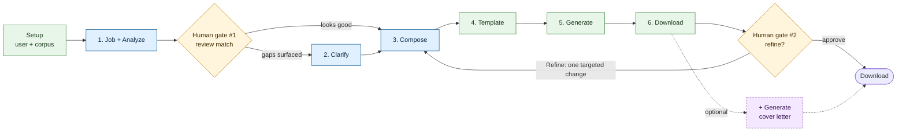
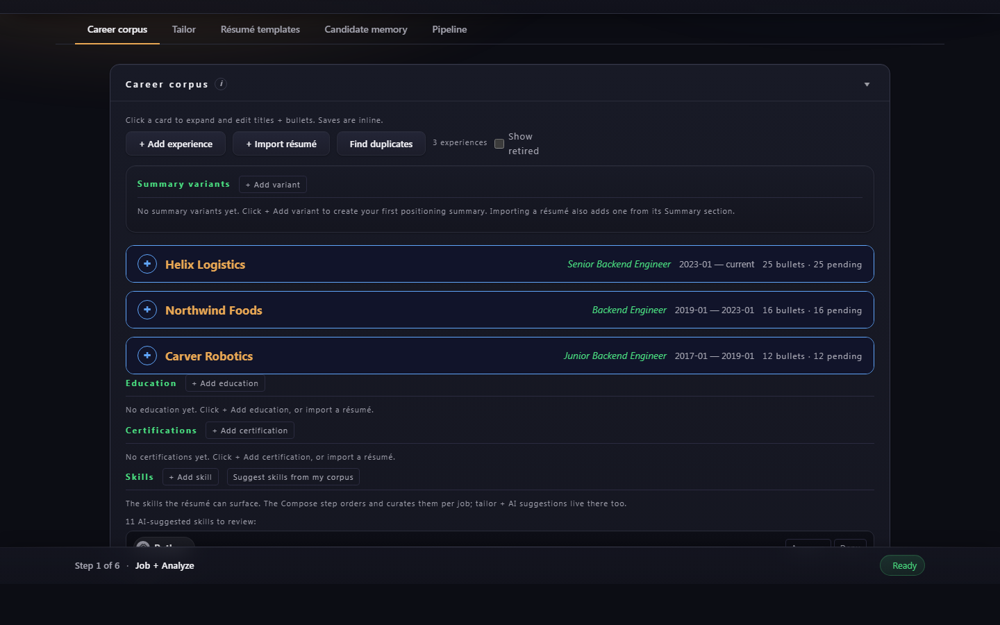
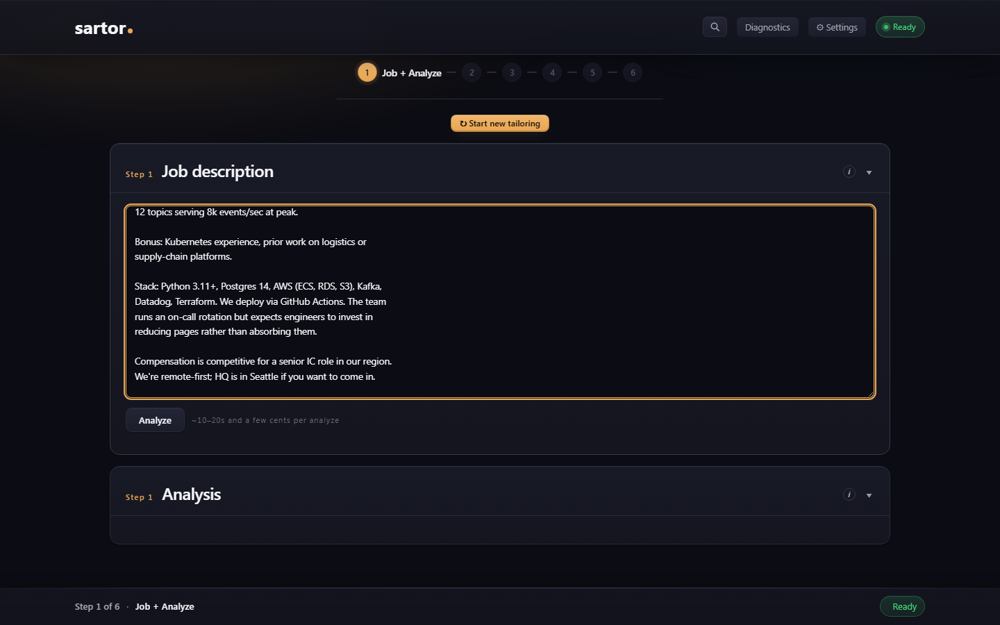
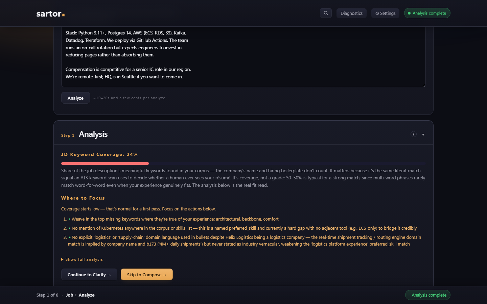
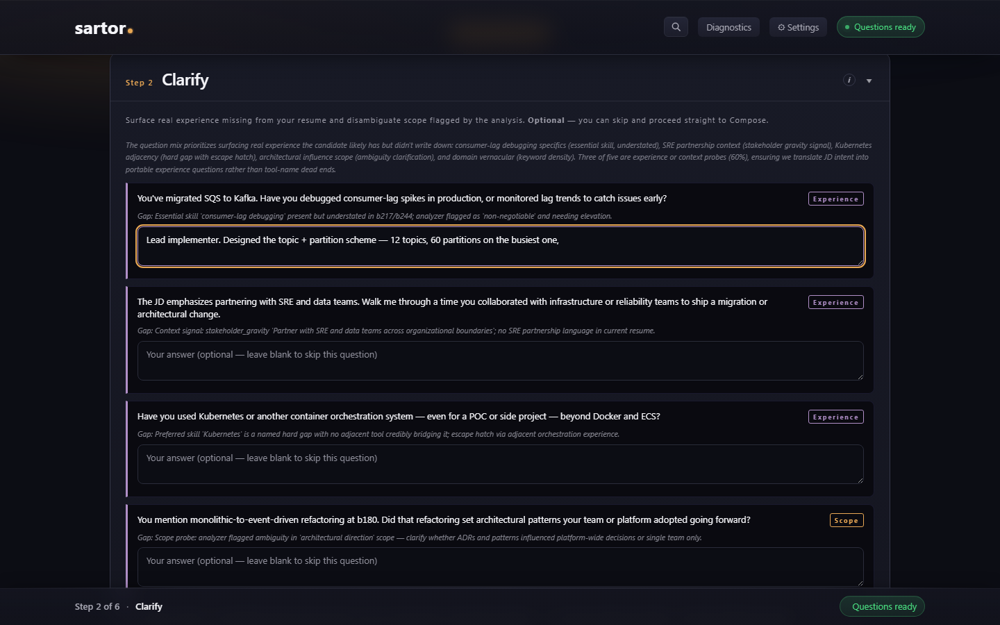
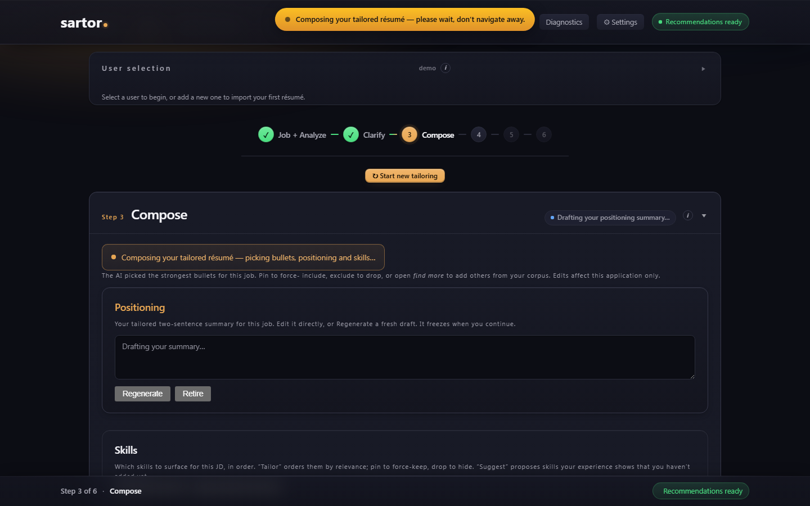
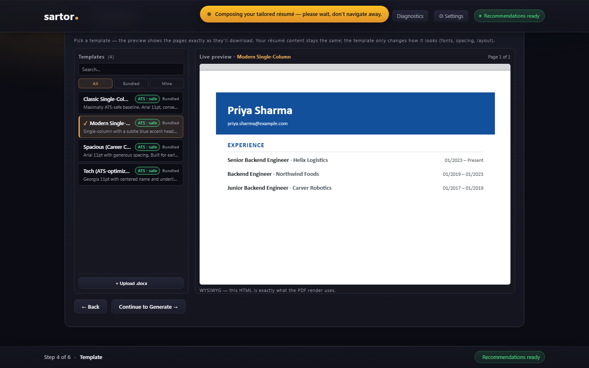
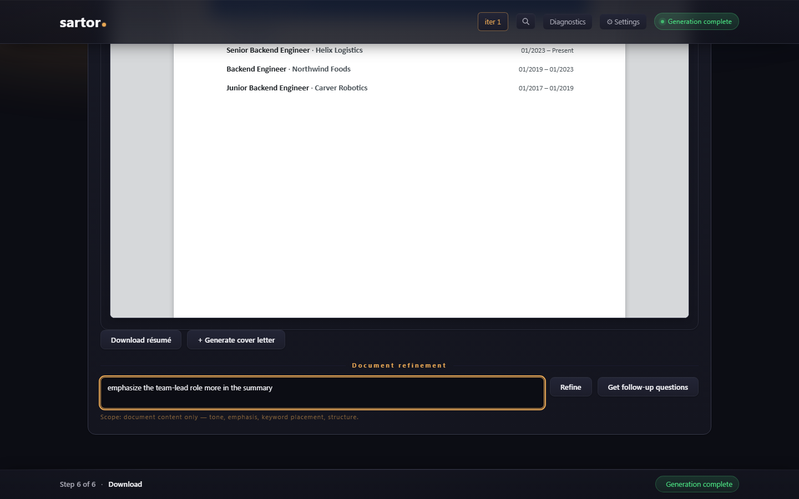
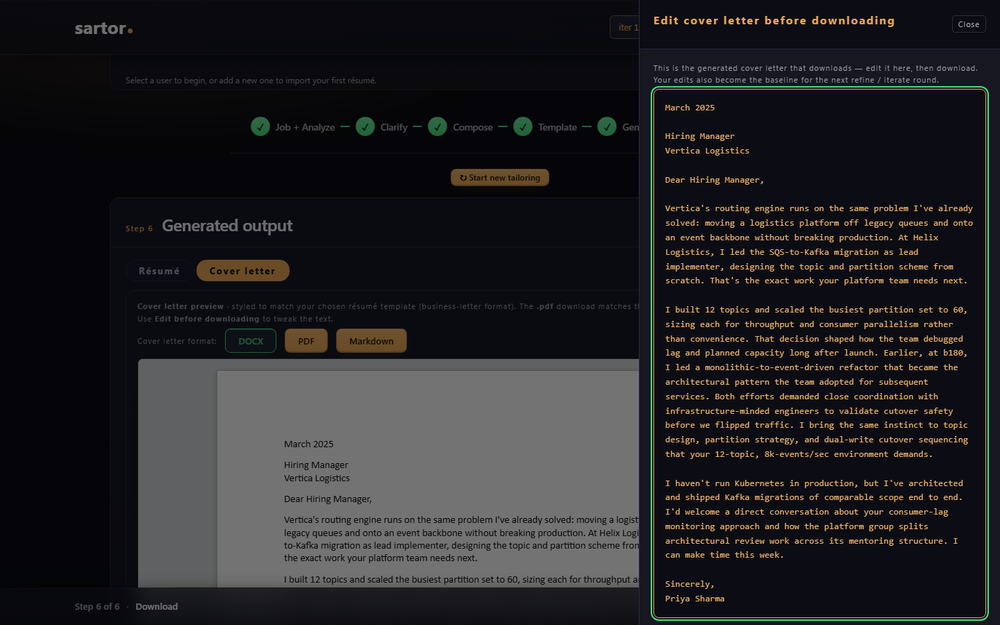

# Using Sartor — screen-by-screen walkthrough

By the end of this doc you'll know what each of the six wizard steps does, which ones use AI, and what to look for before you click forward.

> **Purpose:** the user-facing walkthrough. Each wizard step explained
> in terms of *what you see*, *what you do*, *what happens*, and *what
> to check before continuing*. Two flow diagrams at the top — one for
> screen-to-screen navigation, one for how your information moves
> through the app.
> **Audience:** `user` — people using the app for the first time (or coming
> back after a break and wanting a refresher on which step does what).
> **Type:** tutorial
> **Authoritative for:** the step-by-step user flow of one application;
> which steps use AI and which don't; the human-gate points where the
> wizard pauses for your review. The code-level view of each step (routes,
> model per call) lives in [`docs/dev/architecture.md`](../dev/architecture.md).
> Sibling docs:
> [`README.md`](../../README.md) (overview),
> [`docs/user/install.md`](install.md) (install + first run + cost),
> [`docs/user/iterating.md`](iterating.md) (second applications, refining, earlier work),
> [`vision.md`](../../vision.md) (why Sartor exists).

---

## How to read this doc

The two diagrams below are the map. Skim them first, then read the
step sections for detail: what each step does, whether it uses AI,
and what to look at before moving on.

Acronyms used throughout: **JD** = job description; **AI** here means
the large language model (Anthropic's Claude) that Sartor calls for the
fuzzy work; **ATS** = applicant tracking system (the résumé-reading
software employers run on incoming files).

For one synthetic candidate and job threading through all six steps
with concrete decisions, see
[the worked example](walkthrough-example.md).

---

## User flow — which screen leads where

**Read this left-to-right:** setup feeds the six wizard steps, which
flow left to right. The two amber gates are where you decide: whether
to answer Clarify's questions, and whether to refine the finished
résumé. A refinement sends you **back to Compose** to review one
proposed change. The purple-dashed cover-letter path is optional.

**Legend:** blue = uses AI · green = no AI (instant, and the same input
always gives the same result) · amber = your review · purple-dashed =
optional.

Sartor's design rule is *AI only for the fuzzy work*: reading the job,
asking questions, drafting wording. Rendering your template, assembling
the final document and saving files are ordinary code with no AI. That
is why Steps 4, 5 and 6 are green: once you've approved your content in
Compose, the résumé is assembled from exactly what you approved.

The wizard has **two human gates**:

1. **Gate #1, after Step 1** — read the analysis. Decide whether
   to answer clarifying questions (Step 2) or go straight to Compose
   (Step 3).
2. **Gate #2, in Step 6** — read the finished document. Download it,
   or ask for a refinement.

You can move back to any completed step with the wizard rail at the
top of the page. Going back doesn't re-run the AI unless you ask it to.

---

## Information flow — what you give vs. what Sartor produces

```mermaid
flowchart TB
  subgraph You["What you provide"]
    direction TB
    U1[Your existing résumé<br/>.docx / .pdf / .md]
    U2[Job description text<br/>pasted in Step 1]
    U3[Clarify answers<br/>Step 2, optional]
    U4[Pins, excludes, edits<br/>Step 3]
    U5[Refinement requests<br/>Step 6, plain language]
  end

  subgraph Corpus["⬢ Your career corpus — the single source of truth"]
    direction TB
    K1[Roles + bullets<br/>+ summary variants]
    K2[Skills + tags]
  end

  subgraph System["What Sartor produces"]
    direction TB
    A1[Match summary<br/>+ ATS warnings]
    A2[Clarifying questions]
    A3[Proposed résumé content<br/>bullets, summary, skills]
    A4[Tailored r&#233;sum&#233;<br/>.docx / .pdf / .md]
    A5[Cover letter<br/>optional]
  end

  U1 --> K1 --> A3
  U2 --> A1
  U2 --> A2
  U3 --> K1
  K2 --> A3
  U4 --> A3
  U5 --> A3
  A3 --> A4
  A4 --> A5

  classDef user fill:#fff3e0,stroke:#bf6000,color:#3b2200
  classDef store fill:#eaeaea,stroke:#333,stroke-width:3px,color:#111
  classDef out fill:#e0f0ff,stroke:#0a558c,color:#0a2a44
  class U1,U2,U3,U4,U5 user
  class K1,K2 store
  class A1,A2,A3,A4,A5 out
```

**Read this top-down:** the corpus in the middle is the part everything
depends on. The AI drafts from your corpus, your clarify answers and
your own edits, and it is instructed not to add facts beyond them. That
is a mechanism, not a guarantee, which is why every step leaves you the
final say.

---

## Setup (before the wizard)

### Pick or create a user

Top-right user picker: choose a name from **-- Select User --**, or
click **New user**. Each user has their own corpus, settings and
application history. If you tailor résumés for more than one person,
see [Coaching several people](coaching.md).

### Import your existing résumé (one-time)

Open the **Career corpus** tab → click **+ Import résumé** → upload
your existing `.docx`, `.pdf`, or `.md` résumé.

**What happens:** Sartor reads the text out of your file without AI,
then makes one short AI call to split it into roles, titles and
bullets. The result becomes your **career corpus**, the pool every
application draws from.

**Why a structured corpus instead of just a file:** the wizard needs to
recommend, pin, exclude and reorder individual bullets for each job.
That only works if each bullet is its own item, not text buried inside
a Word document.

You can also add roles and bullets by hand on the corpus tab; the import
is a faster start. **If the import looks wrong** — wrong job titles,
scrambled bullets, missing sections — fix it on the corpus tab. Correcting
it once here is cheaper than fighting bad source data in every later
application.

---

Once the corpus is populated, click the **Tailor** tab in the top bar.
The wizard rail across the top of that tab shows the six steps; it is
how you move between them. **Career corpus** and **Tailor** are the two
views you'll use most.

---

## Step 1 — Job + Analyze

**What you see:** two panels. Left: a box for the job description.
Right: an analysis panel that fills in once you click **Analyze**.

**What you do:** paste the full job description (title, body,
requirements, nice-to-haves). Click **Analyze**.

**What happens:** the AI reads the job against your corpus. This is
the longest single wait in the wizard; the panel shows its progress as
it goes, so a long wait here is normal, not stuck. It returns:

- how your experience matches the job, and where the gaps are;
- ATS warnings (for example, a term the job repeats that your résumé
  never mentions);
- a draft positioning statement.

**Check before continuing (Human gate #1):**

- Skim the match summary. Does the AI's read of the job match what
  you'd say about the role?
- Look at the gaps. Are any of them *real but undocumented* — you have
  the experience, you just never wrote it down? Those are what Clarify
  is for.
- ATS warnings: is anything important missing from your résumé?

If the gaps are empty or irrelevant, skip Clarify and go to Compose.
If they're real, answer Clarify's questions next.

---

## Step 2 — Clarify *(optional)*

**What you see:** a **Get clarifying questions** button (and **Skip**).
Once clicked, a short list of targeted questions, each with a box for
your answer.

**What you do:** answer in your own words. Leave out any that don't
apply. Click **Submit answers, continue →**.

**What happens:** the AI writes questions aimed at the gaps from
Step 1, digging for specifics — numbers, scale, what you owned. Your
answers are saved, used as source material for this résumé, and kept in
**Candidate memory** so later applications can reuse them (see
[Iterating](iterating.md)).

**Why the questions feel pointed:** they're written to get specifics,
not vague claims. A vague answer produces a vague bullet; a specific
one produces a bullet you can defend in an interview.

**Check before continuing (Human gate #1, second pass):**

- Did you actually do what the question is probing? If yes, answer with
  specifics. If no, leave it blank; a blank answer gives the AI nothing
  to build on.
- Numbers and scope you give here can appear nearly word for word in
  your résumé. Be accurate.

---

## Step 3 — Compose

**What you see:** a **Positioning** card at the top with your tailored
two-sentence summary, then one card per role listing its bullets. While
the AI works, a note reads "Composing your tailored résumé — picking
bullets, positioning and skills…".

**What happens:** this is where the tailoring happens. The AI picks the
bullets from your corpus that fit this job best, drafts the positioning
summary, drafts new bullets for job requirements your corpus covers only
partly (each one grounded in what you've told Sartor), suggests skills,
and drafts a one-line intro for each role. Everything it drafts waits
for your decision.

**What you do:**

- **Pin** bullets you want in the final résumé, and **Exclude** ones
  that don't fit this job. Open *find more* to add others from your
  corpus. These choices affect this application only.
- Accept or retire each drafted bullet, and keep or reject each role
  intro.
- Edit the positioning summary directly, click **Regenerate** for a
  fresh draft, or pin one of your saved summary variants as its source.
- **Reorder bullets** within a role by dragging the `≡` handle (or, with
  a keyboard, the Up/Down buttons). This is not cosmetic: recruiters
  read top-down in seconds, so the first bullet under each role does the
  most work. The default order is Sartor's AI fit-ranking; **Reset to AI
  ranking** restores it for that role. A bullet you add after ordering
  lands at the end, marked "newly added — drag to reposition", so your
  order is never silently changed.

Then click **Save and continue to Template →**. That saves (freezes)
your composition: from here on, the résumé is built from exactly what
you approved.

**Check before continuing:**

- Is every bullet you want pinned or kept?
- Is the positioning summary honest? It's the first thing a recruiter
  reads.

---

## Step 4 — Template

**What you see:** the template cards (Classic, Modern, Spacious, Tech)
with ATS-safety badges, a live page-by-page preview, and an
**+ Upload .docx** button for your own Word template.

**What you do:** click a template. The preview redraws right away with
the content you approved in Step 3.

**What happens:** no AI. The template controls how the résumé looks,
never what it says.

**Why the bundled templates are ATS-safe:** all four use a single
column, standard fonts, and no tables or sidebars, so screening software
can read them. A template you upload shows an **ATS · unverified** badge,
because Sartor can't check an arbitrary Word file. See
[Templates](templates.md) for the rules and for uploading your own.

**Check before continuing:**

- Is the page count reasonable? If a mid-career résumé previews at five
  pages, go back to Compose and exclude some bullets.
- Does the style suit your field and seniority?

---

## Step 5 — Generate

**What you see:** output-format buttons (**DOCX**, **PDF**, **Markdown**)
and a **Generate documents** button.

**What you do:** pick a format, click **Generate documents**.

**What happens:**

- **If you saved Compose (the usual case):** no AI call. The résumé is
  assembled instantly from your approved composition. The step says so:
  "Assembled instantly from your approved composition — same input,
  same résumé, no AI variation."
- **If you reached this step without saving Compose:** the AI writes the
  résumé from your curated bullets instead, which takes about 30–60
  seconds.

Each generation is saved as a new file; nothing earlier is overwritten.
PDF output needs an optional component; if it isn't installed, the PDF
button tells you how to add it (see [Install](install.md)).

---

## Step 6 — Download

**What you see:** the finished résumé in a preview, a **Download
résumé** button, **✎ Edit before downloading**, the **Document
refinement** controls, and the cover-letter option.

**What you do (Human gate #2):**

- **Read the résumé carefully.** Does every claim ring true? Are the
  numbers right? Is the scope honest?
- **To change the wording yourself,** use **✎ Edit before downloading**.
  Your edits apply to this document and become the starting point for
  any later refinement.
- **To ask for a change,** describe it in the refinement box ("make the
  tone more formal", "emphasize cloud experience") and click **Refine**.
  Sartor proposes **one targeted change** and takes you back to Compose
  to review it. [Iterating](iterating.md#refining-a-résumé) walks
  through what you'll see there.
- When you're satisfied, click **Download résumé**. After downloading,
  Sartor asks "Submitted this application?" so you can track it (see
  [Iterating](iterating.md#finding-earlier-applications)).

**Check before downloading:**

- Spot-check three to five specific claims (numbers, dates, scope).
  Each should map to something you can defend in an interview.
- If something reads as invented, remove it — with **✎ Edit before
  downloading**, or by excluding the bullet in Compose — rather than
  sending it out and hoping.

---

## Optional — Generate cover letter

**What you see:** a **+ Generate cover letter** option in Step 6, once
the résumé exists.

**What you do:** click it. The AI writes the letter against your
*finished* résumé, so it doesn't claim anything the résumé doesn't. You
can edit it before downloading the same way as the résumé.

**Why it's separate from the main flow:** many applications don't ask
for a cover letter, so it's opt-in and you never pay for one you won't
use.

---

## If something goes wrong mid-wizard

Sartor saves your work as you go, so almost nothing you do is
destructive.

- **You closed the browser tab partway through, or came back the next
  day.** Reopen `http://localhost:5000` and pick the same user. The
  wizard starts at Step 1, but your application is saved: open the
  **Pipeline** tab, click the application, and choose **Resume in
  wizard** to pick up where you left off. Your corpus is always kept.
- **An AI call failed.** The step's button is safe to click again. See
  [Install → Troubleshooting](install.md#troubleshooting) for
  symptom-by-symptom help.
- **You want to start over.** Click **↻ Start new tailoring** next to the
  wizard rail. It clears the current run and returns to Step 1; your
  corpus and your earlier applications are untouched.

---

## After the wizard — where your files live

| Path | What it is |
|---|---|
| `output/<user>/resume_<timestamp>.docx` (or `.pdf`, `.md`) | The generated résumé |
| `output/<user>/cover_letter_<timestamp>.docx` (or `.pdf`, `.md`) | The generated cover letter |
| `output/<user>/context_<timestamp>.json` | A snapshot of everything that went into that document |
| `db/resume.sqlite` | Your career corpus and application history, for every user |

Every generation writes new files and overwrites nothing, so each
document you've produced can be traced back to what went into it.

---

## See also

- [Iterating](iterating.md) — your second application, refining, and
  finding earlier work.
- [Install](install.md) — install, first run, and what an application
  costs.
- [`SECURITY.md`](../../SECURITY.md) — what stays on your machine and
  what goes over the network.
- [`vision.md`](../../vision.md) — why Sartor exists.
- [`docs/dev/architecture.md`](../dev/architecture.md) — the same
  pipeline from the code's side: which route and which model each step
  uses.
