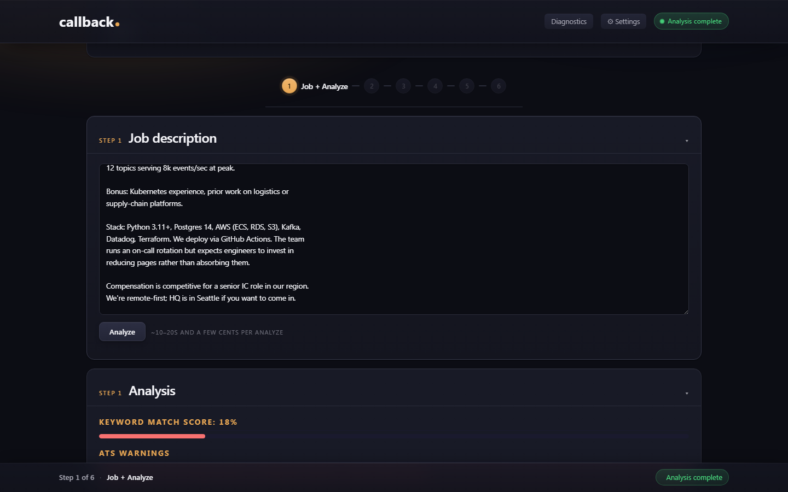

# Screenshot capture checklist

> **Purpose:** the executable companion to the Screenshot Manifest
> in [`onboarding_audit_2026-05-25.md`](onboarding_audit_2026-05-25.md).
> A step-by-step procedure for capturing the 10 manifest
> screenshots, plus the filename convention, target docs, and
> alt-text drafts.
> **Audience:** whoever (human + Claude) actually runs the app
> and captures the screenshots — likely you, with Claude doing
> the markdown insertions in a follow-up.
> **Authoritative for:** the capture filenames, the post-capture
> markdown insertion plan, the alt-text drafts. The *what to
> show* in each shot still lives in the audit's manifest.

---

## Pre-capture setup

Before starting, set the app and environment to a clean, neutral
state so the screenshots will age well.

1. **Use a synthetic user.** Don't capture from your real user.
   Create a user named `demo` if it doesn't exist:
   - Open the app at `http://localhost:5000`.
   - Top-right user picker → **+ Create user** → name `demo`.
2. **Use a synthetic corpus.** Import a synthetic résumé into
   `demo`'s corpus, NOT your real one. A good source is the
   "Priya" persona used in
   [`docs/walkthrough_example.md`](../walkthrough_example.md);
   construct a 3-experience, ~8-bullets-each `.docx` matching
   her shape, save as `resumes/demo/priya_master.docx`, and
   import via `+ Import résumé`.
3. **Use a synthetic JD.** For Step 1+ shots, paste the Vertica
   Logistics JD from
   [`docs/walkthrough_example.md`](../walkthrough_example.md#the-job)
   verbatim. Consistent JD across shots keeps the analysis
   numbers comparable.
4. **Browser setup:**
   - Use Chrome or Edge at 1440 × 900 viewport (standard desktop
     screenshot resolution for docs). Resize via DevTools
     responsive mode if needed.
   - Light mode (the docs render light-theme by default;
     dark-mode shots will clash).
   - Hide bookmarks bar (Ctrl+Shift+B on Windows) so the
     captured window is just the app.
   - Devtools closed for the actual shot.
5. **Capture tool:** Windows Snipping Tool (`Win+Shift+S`) or
   the Edge built-in capture works. Save as `.png`. Each shot
   should be just the browser viewport, not the full desktop.

---

## Filename convention

All screenshots land in `c:/Dev/sartor/docs/screenshots/`
(create the directory if missing).

Pattern: `<doc-stem>_<step-id>_<short-name>.png`

- `<doc-stem>` — `readme` / `install` / `walkthrough`
- `<step-id>` — `hero` / `setup` / `step1pre` / `step1post` /
  `step2` / `step3` / `step4` / `step6` / `coverletter`
- `<short-name>` — 1–3 hyphenated words (e.g., `analyze-filled`)

Example: `walkthrough_step1pre_jd-textarea.png`.

---

## The 10 captures

For each one: set up the UI state, take the shot, save with the
specified filename. Don't worry about annotations / callouts
during capture — those land in markdown alt-text + caption text
when Claude does the insertion pass.

### S01 — README hero (P0)

- **Filename:** `readme_hero_wizard-step1-filled.png`
- **UI state:** Step 1 active, wizard rail visible at top with
  Step 1 highlighted, the analysis panel (right side) populated
  from a completed analyze call against the Vertica JD.
- **Show:** full app viewport including wizard rail, both
  panels, and any visible Human Gate #1 indicator.
- **Insertion site:** README.md, "The wizard at a glance" §,
  after the ASCII block (line ~109).
- **Alt-text draft:** *"sartor.'s six-step wizard with Step 1
  active. The wizard rail at the top shows step progression;
  the right panel shows the analysis output that the user
  reviews at Human Gate #1 before deciding whether to enter
  Clarify or skip to Compose."*

### S02 — Setup, user picker (P1)

- **Filename:** `install_setup_user-picker.png`
- **UI state:** click the top-right user picker so the dropdown
  is open. It should show the default user(s) plus `demo`
  highlighted, with the **+ Create user** affordance visible at
  the bottom of the dropdown.
- **Insertion site:** docs/install.md, "First-run walkthrough"
  §, after step 1 (line ~184).
- **Alt-text draft:** *"The user picker dropdown in the
  top-right corner. Each user has their own corpus, settings,
  and output history."*

### S03 — Setup, Career Corpus pre-import (P0)

- **Filename:** `walkthrough_setup_corpus-empty.png`
- **UI state:** Career Corpus tab selected, empty experience
  list visible, the `+ Import résumé` button prominent. Take
  the shot *before* importing the synthetic résumé so it shows
  the empty state.
- **Insertion site:** docs/walkthrough.md, "Setup (before the
  wizard)" §, after "Import your existing résumé" (line ~144).
- **Alt-text draft:** *"The Career Corpus tab in its empty
  state. The + Import résumé button parses an existing résumé
  into the structured corpus (one Haiku call, ~$0.02)."*

### S04 — Step 1 pre-analyze (P0)

- **Filename:** `walkthrough_step1pre_jd-textarea.png`
- **UI state:** Step 1 active. JD textarea on the left with the
  Vertica JD pasted in but **Analyze not yet clicked** — the
  right panel should be empty / placeholder. The Analyze button
  should be prominent.
- **Insertion site:** docs/walkthrough.md, "Step 1 — Job +
  Analyze" §, after "What you see" (line ~169).
- **Alt-text draft:** *"Step 1 with the job description pasted
  into the left textarea. Clicking Analyze triggers a ~30–60s
  Sonnet 4.6 call that fills the right panel with skill
  matches, gaps, and ATS warnings."*

### S05 — Step 1 post-analyze (P0)

- **Filename:** `walkthrough_step1post_analysis-filled.png`
- **UI state:** Same screen as S04, but after Analyze has
  completed. The right panel should show: skill matches,
  potential gaps (with the team-leadership gap and the Kafka
  underdocumented call-out), ATS warnings (Kafka frequency).
- **Insertion site:** docs/walkthrough.md, "Step 1 — Job +
  Analyze" §, after "Verify before continuing" (line ~195).
- **Alt-text draft:** *"Step 1 after analyze: the right panel
  shows skill matches, a gaps section, and ATS warnings. This
  is Human Gate #1 — the user reads it and decides whether to
  enter Clarify next."*

### S06 — Step 2 Clarify (P1)

- **Filename:** `walkthrough_step2_clarify-questions.png`
- **UI state:** Step 2 active with the 4 generated questions
  visible. Type a partial answer in one of them (e.g., a few
  words about Kafka migration scope) so the textarea state is
  realistic — not pristine, not finished.
- **Insertion site:** docs/walkthrough.md, "Step 2 — Clarify"
  §, after "What you see" (line ~206).
- **Alt-text draft:** *"The Clarify step with 4 targeted
  questions. Answers given here become legitimate source
  material for Step 5 generation."*

### S07 — Step 3 Compose (P0)

- **Filename:** `walkthrough_step3_compose-experience-card.png`
- **UI state:** Step 3 active, one experience card (Helix
  Logistics) expanded. Visible state should show: at least one
  pinned bullet (with the pin indicator), one excluded bullet
  (with the strikethrough or exclude indicator), one
  LLM-recommended bullet (with its proposal badge), and the
  summary variant picker at the top.
- **Insertion site:** docs/walkthrough.md, "Step 3 — Compose"
  §, after "What you see" (line ~248).
- **Alt-text draft:** *"The Compose step showing one experience
  card with pinned, excluded, and LLM-recommended bullets, plus
  the summary variant picker. Compose is a selection problem;
  Haiku 4.5 ranks and proposes, the user decides."*

### S08 — Step 4 Template (P1)

- **Filename:** `walkthrough_step4_template-modern-preview.png`
- **UI state:** Step 4 active, four template cards in a row,
  **Modern** selected, the live preview pane on the right
  showing the first page of the rendered résumé. ATS-safety
  badges visible on each card. The "Page 1 of 2" counter
  visible.
- **Insertion site:** docs/walkthrough.md, "Step 4 — Template"
  §, after "What you see" (line ~293).
- **Alt-text draft:** *"The Template step with four ATS-safe
  templates shown as cards. Live preview re-renders on
  selection — no LLM call. The Page 1 of N counter reflects
  the real paged.js page count."*

### S09 — Step 6 Download (P0)

- **Filename:** `walkthrough_step6_download-with-refine.png`
- **UI state:** Step 6 active. The generated résumé preview
  visible on the left. The Refine textarea on the right should
  have a sample note typed in (e.g., "emphasize the team-lead
  role more"). Both **Download** and **+ Generate cover
  letter** buttons visible.
- **Insertion site:** docs/walkthrough.md, "Step 6 — Download"
  §, after "What you see" (line ~366).
- **Alt-text draft:** *"The Download step. The generated
  résumé preview is on the left; the Refine textarea on the
  right takes natural-language change requests. Each Refine
  click re-runs generate() (~$0.05–$0.15) and writes a new
  child context_*.json to preserve the audit trail."*

### S10 — Cover letter (P2)

- **Filename:** `walkthrough_coverletter_first-generation.png`
- **UI state:** Cover letter preview pane after the **+
  Generate cover letter** button has been clicked once. Refine
  textarea visible.
- **Insertion site:** docs/walkthrough.md, "Optional — Generate
  cover letter" § (line ~403).
- **Alt-text draft:** *"The cover-letter generation surface.
  The cover letter is generated against the finalized résumé,
  with the same refine / iterate parity as the résumé flow."*

---

## After capture — markdown insertion

Once all 10 PNGs land in `docs/screenshots/`, the markdown
insertion is straightforward. For each shot:

```markdown

```

(Use `../screenshots/...` from `docs/install.md` and
`docs/walkthrough.md`. From `README.md` use `docs/screenshots/...`.)

For the P0 captures, consider wrapping in a figure caption block
so the docs render with named figure references:

```markdown
<figure>
  ">
  <figcaption><strong>Figure 5.</strong> Step 1 after analyze —
  the user is now at Human Gate #1.</figcaption>
</figure>
```

GitHub renders this; most local markdown viewers do too.

---

## Sanity checks after insertion

- Run the VS Code Markdown preview (with the
  `bierner.markdown-mermaid` extension installed) on each
  modified doc and confirm every image loads.
- `gitignore` review: `docs/screenshots/` should NOT be
  gitignored — these are first-class doc assets, unlike
  `output/` or `resumes/`. Verify with `git status` after
  adding the first PNG.
- File-size discipline: keep each PNG under ~250 KB. If a
  capture is larger, run it through a PNG optimizer
  (`oxipng` / `pngcrush` / TinyPNG online) before committing.
  The doc set should not balloon the repo size.

---

## What this checklist does NOT cover

- **Annotation overlays** (arrows, callouts on the screenshots
  themselves). Out of scope — modern docs convention is to
  put callout language in the alt-text / caption rather than
  edit the image. If a callout is genuinely needed, use a
  one-off tool like macOS Preview or the Snip & Sketch
  highlighter, and save as a *separate* annotated version with
  `_annotated` suffix.
- **Animated GIFs.** A demo GIF is listed in
  [`docs/dev/RELEASE_CHECKLIST.md`](../dev/RELEASE_CHECKLIST.md) under
  "Nice to have." Different artifact, different procedure.
- **Re-capture cadence.** Screenshots will rot as the UI
  evolves. The audit-doc pattern (timestamped under
  `docs/ux/`) is the right convention — re-audit and
  re-capture on a release cadence, archive prior captures
  under `docs/archive/screenshots_YYYY-MM-DD/` if you want
  the history.
