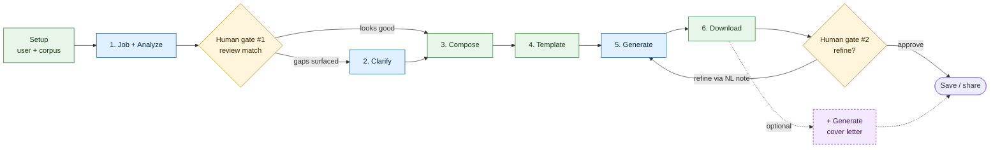
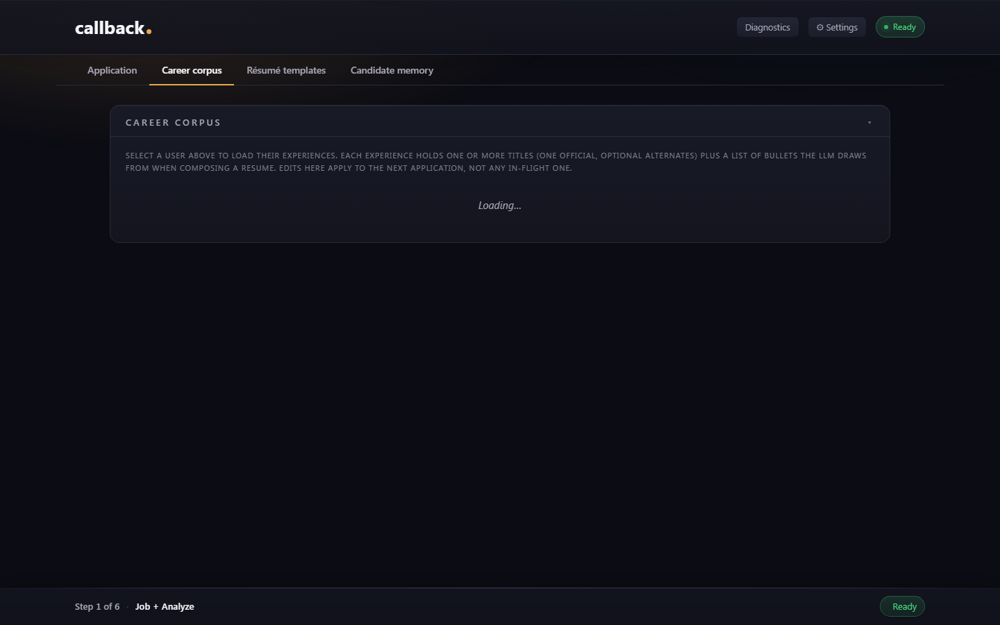
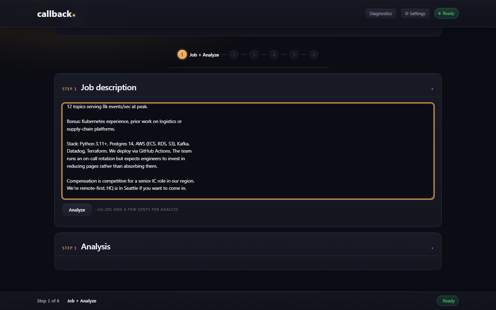
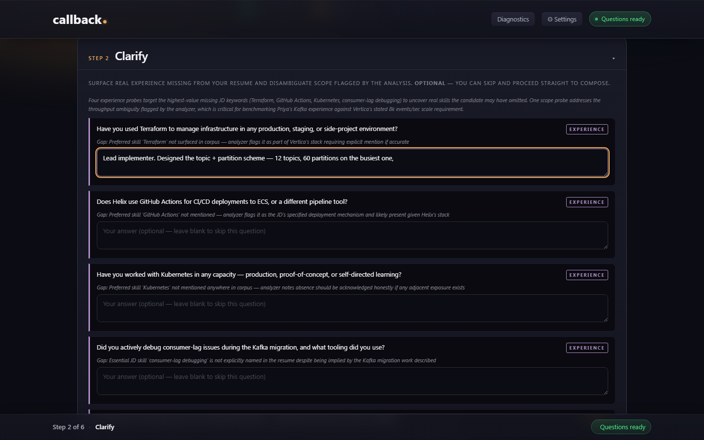
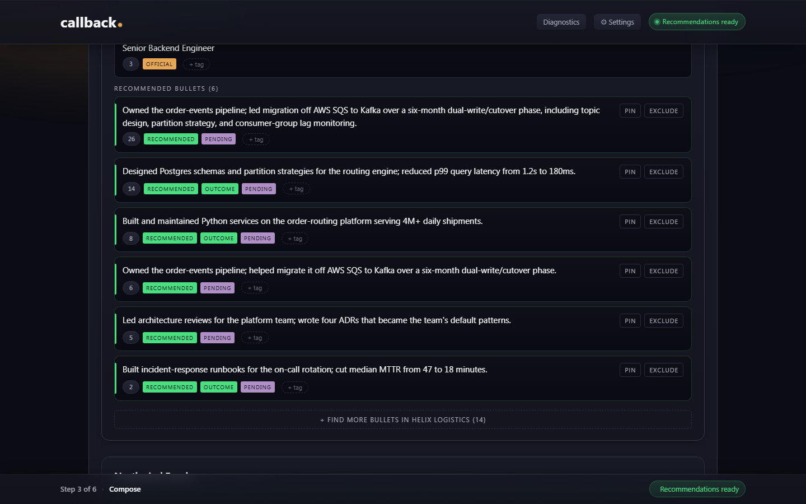
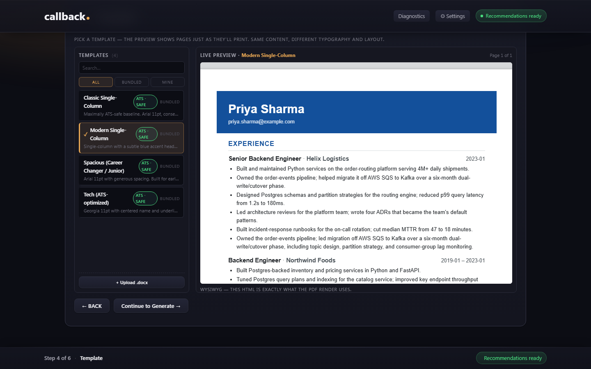
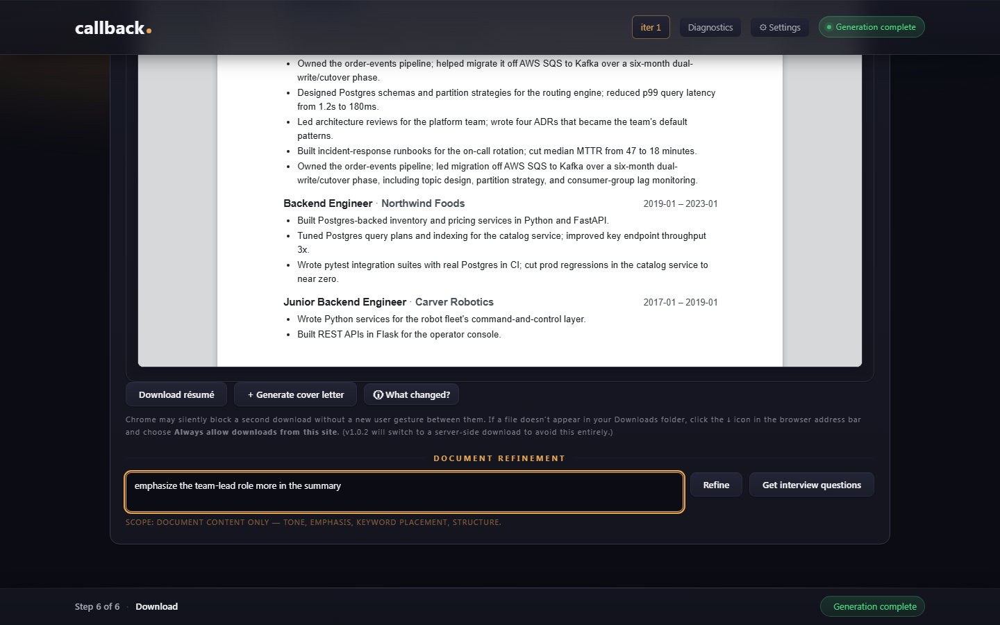
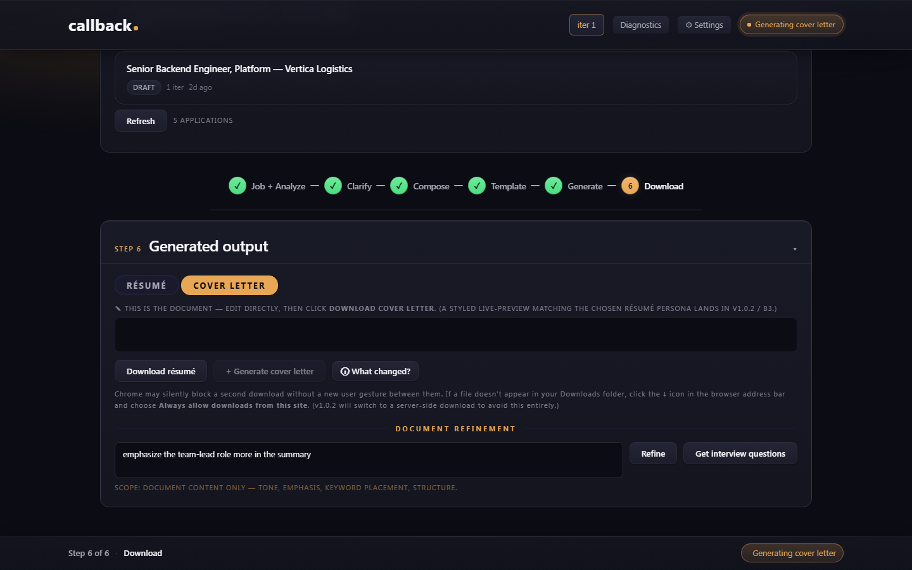

# Using callback. — screen-by-screen walkthrough

By the end of this doc you'll know what each of the six wizard steps does, what it costs, and what to look for before you click forward.

> **Purpose:** the user-facing walkthrough. Each wizard step explained
> in terms of *what you see*, *what you do*, *what's happening under
> the hood*, and *what to verify before continuing*. Two flow diagrams
> at the top — one for screen-to-screen navigation, one for how your
> data moves through the system.
> **Audience:** humans using the app for the first time (or coming
> back after a break and wanting a refresher on which step does what).
> **Authoritative for:** the canonical step-by-step user flow; the
> mapping from each screen to its Flask route + LLM call + cost band;
> the human-gate points where the wizard pauses for your review.
> Sibling docs:
> [`README.md`](../README.md) (overview + Doc Map),
> [`docs/install.md`](install.md) (install + first-run),
> [`docs/architecture.md`](architecture.md) (code-level system view),
> [`vision.md`](../vision.md) (why callback. exists).

---

## How to read this doc

The two diagrams below are the map. Skim them first, then read the
per-step sections for the educational depth — what each LLM call is
actually doing, what's deterministic, and what to look at before
moving on.

Acronyms used throughout: **JD** = job description; **LLM** = large
language model (Anthropic Claude); **ATS** = applicant tracking
system (résumé parsing software employers run on incoming files).

For a single synthetic candidate + JD threading through all six
steps with concrete decisions, see
[`walkthrough_example.md`](walkthrough_example.md).

---

## User flow — which screen leads where

**Legend:** blue = LLM call fires here · green = deterministic
(no LLM) · amber = human review gate · purple-dashed = optional path.

callback.'s design rule is *LLM only for fuzzy work*; everything
else (parsing, rendering, file I/O) is plain Python you can trace
line-by-line. The diagram's green nodes are the parts you can
debug without paying for an API call.

The wizard has **two required human gates**:

1. **Gate #1, after Step 1** — read the analysis. Decide whether
   to enter Clarify (Step 2) or skip straight to Compose (Step 3).
2. **Gate #2, in Step 6** — read the generated document.
   Refine via natural-language note (re-runs Step 5 with edit-aware
   context) or approve and download.

You can navigate backward through completed steps via the wizard
rail at the top of the app — the LLM calls don't re-run unless you
explicitly re-trigger them.

---

## Information flow — what you give vs. what the system produces

```mermaid
flowchart TB
  subgraph You["What you provide"]
    direction TB
    U1[Master résumé<br/>.docx / .pdf / .md]
    U2[JD text<br/>pasted in Step 1]
    U3[Clarify answers<br/>Step 2, optional]
    U4[Bullet pins / excludes<br/>Step 3]
    U5[Refinement notes<br/>Step 6, natural language]
  end

  subgraph Corpus["⬢ Structured career corpus (db/resume.sqlite) — single source of truth"]
    direction TB
    K1[Experiences + bullets<br/>+ summary variants]
    K2[Tags + skills + scores]
  end

  subgraph System["What the system computes"]
    direction TB
    A1[Match summary<br/>+ ATS warnings]
    A2[Clarification questions<br/>3-5 targeted]
    A3[Recommended bullets<br/>+ summary variant]
    A4[Tailored r&#233;sum&#233;<br/>.docx / .pdf / .md]
    A5[Cover letter<br/>opt-in]
  end

  U1 --> K1 --> A3
  U2 --> A1
  U2 --> A2
  U3 --> K1
  K2 --> A3
  A3 --> A4
  U4 --> A4
  U5 --> A4
  A4 --> A5

  classDef user fill:#fff3e0,stroke:#bf6000,color:#3b2200
  classDef store fill:#eaeaea,stroke:#333,stroke-width:3px,color:#111
  classDef out fill:#e0f0ff,stroke:#0a558c,color:#0a2a44
  class U1,U2,U3,U4,U5 user
  class K1,K2 store
  class A1,A2,A3,A4,A5 out
```

**Read this top-down:** the corpus in the middle is the load-bearing
artifact. Every LLM call reads from it; nothing gets invented that
isn't already in your corpus, clarifications, or typed edits. That's
the grounding rule — it's enforced by the system prompt in
[`analyzer.py`](../analyzer.py) and verified post-generation by the
`grounding_overlap` metric.

---

## Setup (before the wizard)

### Pick or create a user

Top-right user picker. Each user has their own corpus, settings,
and output history. Files live under `configs/<user>.config`,
`resumes/<user>/`, and `output/<user>/`.

### Import your existing résumé (one-time)

Open the **Career Corpus** tab → click **+ Import résumé** → upload
your existing `.docx`, `.pdf`, or `.md` résumé.

**Under the hood:** [`/api/upload`](../app.py) runs `parser.py`
deterministically (no LLM) to extract text, then one Haiku 4.5
call to `extract_experiences()` parses the text into structured
experiences, titles, and bullets. Haiku 4.5 is Anthropic's small +
fast model — callback. uses it for selection and parsing; the
larger Sonnet 4.6 model handles writing. Cost: ~$0.02. The result
writes to `db/resume.sqlite` as the canonical corpus.

**Why a structured corpus instead of just file uploads:** the
wizard needs to recommend, pin, exclude, and re-rank individual
bullets per application. That only works if each bullet is a
first-class row in the corpus, not buried inside a Word document.
See [`docs/PRODUCT_SHAPE.md`](PRODUCT_SHAPE.md) for the Corpus Item
pattern.

You can also add experiences and bullets manually through the
corpus tab. The import is just a faster start. **If extraction
looks wrong** — wrong job titles, scrambled bullets, missing
sections — open the Corpus tab and edit them by hand. The parser
is deterministic but no parser is perfect on every résumé layout;
correcting it once here is cheaper than fighting bad source data
through every later step.

---

Once the corpus is populated, click the **Application** tab in the top bar,
then select **Step 1 — Job + Analyze** in the wizard rail that appears across
the top of the page. The wizard rail is how you move between steps; the
Corpus and Application tabs are the two top-level views of the app.

---

## Step 1 — Job + Analyze

**What you see:** two panels. Left: a textarea labeled "Job
description" with a paste-the-JD prompt. Right: an empty analysis
panel that fills in once you click **Analyze**.

**What you do:** paste the full JD (title + body + requirements +
nice-to-haves). Click **Analyze**.

**Under the hood:** [`/api/analyze`](../app.py) calls
`analyze()` in [`analyzer.py`](../analyzer.py).

- **Model:** Sonnet 4.6 (the heavy-reasoning model — Sonnet is used
  for any call where the LLM is writing or reasoning, not picking).
- **Cost:** ~$0.04 per call (most of the user prefix is cache-hit
  on the second analysis in a session).
- **Latency:** ~30–60s — the slowest call in the pipeline. It
  re-reads the JD + your full master résumé + any LinkedIn /
  portfolio scrape on every analyze call, which is why the wait
  is real. A spinner that long is normal here; it's not stuck.
- **What it returns:** a structured analysis with skill matches,
  potential gaps, ATS warnings (e.g., "the JD mentions Kafka 6
  times — make sure your résumé reflects that if it's true"), and
  a draft positioning statement.

**Verify before continuing (Human gate #1):**

- Skim the match summary. Does the LLM's read of the JD align with
  what you'd say about the role?
- Look at the gaps section. Are any of those *real but
  undocumented* (you have the experience but didn't write it
  down)? → those are candidates for Clarify.
- ATS warnings — anything load-bearing missing from your résumé?

If everything looks good and the gaps section is empty or
irrelevant: skip Clarify, go to Compose. If gaps are real, enter
Clarify next.

---

## Step 2 — Clarify *(optional)*

**What you see:** 3–5 LLM-generated interview questions in a
scrollable list, each with a textarea for your answer.

**What you do:** answer the questions in your own words. Skip any
that aren't relevant. Click **Submit clarifications**.

**Under the hood:** two routes are involved.

- [`/api/clarify`](../app.py) calls `clarify()` in
  [`analyzer.py`](../analyzer.py) — Sonnet 4.6, ~$0.03.
  Reads the analysis from Step 1 and the gap list, asks
  *targeted* questions to surface real-but-undocumented experience.
- [`/api/answer-clarifications`](../app.py) saves your answers into
  the `context_set` so downstream steps can use them. No LLM call
  on submit — pure persistence.
- (Iterative re-clarify available via
  [`/api/iterate-clarify`](../app.py) →
  `clarify_iteration()` — same model, similar cost. Used if your
  first round of answers opened up new gaps.)

**Why the questions feel pointed:** the system prompt for
`clarify()` is a hiring-manager-as-interviewer persona — it's
written to dig for specifics (numbers, scale, ownership scope),
not to fish for vague claims. Your honest answers become legitimate
source material for generation (the grounding rule widens to accept
them). If a question feels uncomfortably specific, that's the
point: a vague answer here produces a vague bullet at Step 5.

**Verify before continuing (Human gate #1, second pass):**

- Did you actually have the experience the question is probing?
  If yes, answer with specifics. If no, leave it blank — the LLM
  won't invent.
- Numbers and scope claims here will show up nearly verbatim in
  Step 5's generated bullets. Be accurate.

---

## Step 3 — Compose

**What you see:** experience cards. Each card lists your existing
bullets plus LLM-recommended bullets (badged differently). At the
top, a **Positioning** card with the draft summary; a summary
variants picker; a tag-chip filter for bullets.

**What you do:** for each experience —

- **Pin** bullets you definitely want in the final résumé.
- **Exclude** bullets that don't fit this JD.
- Accept, reject, or edit **LLM-recommended bullets** (proposals
  drawn from your clarifications or rewrites of existing bullets
  for this JD's vocabulary).
- Pick a **summary variant** (the LLM proposed 2–3; pick the one
  that fits or write your own).

**Under the hood:** Compose makes Haiku 4.5 calls — the cheap,
fast model used for *picking* and *re-ranking*, not for writing
fresh prose.

- `recommend_bullets()` in
  [`analyzer.py`](../analyzer.py) — Haiku 4.5, ~$0.01 per
  experience. Reads the corpus + JD + clarifications, returns a
  ranked list of which bullets to surface.
- `recommend_summaries()` — Haiku 4.5, ~$0.005. Reads existing
  summary variants and proposes new ones tuned to this JD.
- `critique_proposal()` — Haiku 4.5, ~$0.005 per proposal. When
  you accept a proposal, this call validates whether to fold it
  into the corpus permanently or keep it application-scoped.

**Why Haiku here and Sonnet for generate:** the Compose step is a
selection problem (which bullets / which summary), not a writing
problem. Haiku is faster and ~10× cheaper at selection, and the
grounding check in Step 5 catches anything Haiku slips through.

**Verify before continuing:**

- Have you pinned at least one bullet per experience you want in
  the final résumé? Unpinned bullets may be dropped during
  generation if they don't earn their slot.
- Is the chosen summary variant honest? It will be the first thing
  a recruiter reads.

---

## Step 4 — Template

**What you see:** four template cards (Classic, Modern, Spacious,
Tech) with ATS-safety badges; a live paginated preview on the
right; an **+ Upload template** button for your own `.docx`.

**What you do:** click a template. The preview re-renders in real
time using the bullets and summary you composed in Step 3.

**Under the hood:** *no LLM call.* This step is fully deterministic.

- The preview is rendered by `generator.py` + `pdf_render.py`
  (Playwright + Chromium) into HTML, then paged.js (a vendored
  third-party library, see
  [`SECURITY.md`](../SECURITY.md)) splits it into discrete
  Letter-sized page boxes inside an `<iframe>`.
- The "Page 1 of N" counter reflects the *real* paged.js page
  count via postMessage, not a scroll-height estimate.

**Why all four bundled templates are ATS-safe:** the four shipped
templates use single-column layouts with standard fonts and no
inline `<code>` chips or sidebar layouts. The two retired templates
(Compact, Hybrid Tech) failed ATS testing — they're documented in
[`CHANGELOG.md`](../CHANGELOG.md) for v1.0.0. Uploaded templates
show an "ATS · unverified" badge because callback. can't
introspect arbitrary user `.docx` files.

**Verify before continuing:**

- Page count reasonable? If you're a senior engineer and the
  preview says 5 pages, something is off — go back to Compose and
  exclude more bullets.
- Does the styling reflect your seniority and field? Tech serif vs.
  Classic sans-serif is a real signal.

---

## Step 5 — Generate

**What you see:** a **Generate** button with format toggles
(`.docx`, `.pdf`, `.md`); a progress indicator while the LLM call
runs; a preview of the generated text once done.

**What you do:** pick a format, click **Generate**. Wait ~30–60s.

**Under the hood:** [`/api/generate`](../app.py) calls
`generate()` in [`analyzer.py`](../analyzer.py).

- **Model:** Sonnet 4.6 — this is the writing call, the heaviest
  reasoning point in the pipeline.
- **Cost:** ~$0.05–$0.15 depending on context size (longer corpus +
  more clarifications = more tokens).
- **Latency:** ~30–60s.
- **What it does:** reads the full `context_set` (résumé + JD +
  clarifications + Compose decisions + Positioning) and writes a
  tailored résumé that *only uses facts present in the context*.
  This is the grounding rule.
- **Each generate writes a NEW timestamped child file** under
  `output/<user>/context_<timestamp>.json`. The
  `parent_context_path` field links the chain — that's your
  iteration audit trail.
- After generation, four deterministic metrics are computed: verb
  diversity, specificity density, grounding overlap (the
  fabrication signal — anything in the output that *isn't* in the
  context shows up in `grounding_overlap.missing_samples`), and
  cost. These ride along on every result for the eval dashboard.

**Verify before continuing:**

- Move to Step 6 to read the actual generated document.

---

## Step 6 — Download

**What you see:** the generated résumé in a preview pane; a
**Refine** textarea; a **Download** button; an **+ Generate cover
letter** button.

**What you do (Human gate #2):**

- **Read the generated résumé carefully.** Does every claim ring
  true? Are numbers accurate? Are scope claims honest?
- If something needs to change, write a natural-language note in
  the **Refine** box ("emphasize the team-lead role more",
  "shorten the second experience", "swap in the Kubernetes
  bullet"). Click **Refine** — this re-runs `generate()` with
  the note appended as edit-aware context.
- When satisfied, click **Download**. The file lives under
  `output/<user>/`.

**Under the hood (refine):** [`/api/save-edits`](../app.py) records
your refinement note, then re-calls `generate()` with the chain
extended (new `parent_context_path` pointing at the previous
iteration). Each iteration is a fresh child file — nothing is
overwritten. Cost: another ~$0.05–$0.15.

**Why refinement is "edit-aware" instead of fully regenerating:**
the grounding rule widens during refinement to accept your typed
edits as legitimate source material. The system can incorporate
"emphasize Y" without inventing Y if Y is in your corpus, your
clarifications, or your typed edit.

**Verify before downloading:**

- Spot-check three to five specific claims (numbers, dates,
  scopes). Each should map to something you can defend in an
  interview.
- If the `grounding_overlap` metric is low and you can see
  invented details in the preview, refine again — don't just
  download and edit by hand. The signal exists for a reason.

---

## Optional — Generate cover letter

**What you see:** a **+ Generate cover letter** button at the
bottom of Step 6, available once the résumé is generated.

**What you do:** click it. The cover letter generates against the
*finalized* résumé (so it doesn't claim anything the résumé
doesn't), then you can refine it the same way as the résumé.

**Under the hood:** [`/api/generate-cover-letter`](../app.py)
calls `generate_cover_letter_against_resume()` in
[`analyzer.py`](../analyzer.py) — Sonnet 4.6, ~$0.04–$0.08.
The cover letter has full refine/iterate parity with the résumé
flow (same edit-aware refinement, same audit trail).

**Why cover letter is detached from the main flow:** about a third
of applications don't ask for one. The β.5 release made it opt-in
specifically so users aren't paying for a cover letter call they'll
never use.

---

## If something goes wrong mid-wizard

callback. writes a new `context_*.json` file at every state
change, so almost nothing you do is destructive.

- **You closed the browser tab partway through.** Reopen
  `http://localhost:5000`, pick the same user, and the wizard
  resumes from your last completed step. The corpus, your JD
  paste, your clarifications, and any prior generations are all
  loaded from disk.
- **You came back the next day.** Same — pick the user, the most
  recent in-flight application is restored. Past applications
  live under `output/<user>/` as a chain of `context_*.json`
  files linked by `parent_context_path`.
- **An LLM call errored out.** The `context_set` for that
  attempt is saved; the step's button is safe to re-click. See
  [`docs/install.md`](install.md#troubleshooting) for the
  symptom-by-symptom guide.
- **You want to start over for the same JD.** Start a new
  application from the Application tab; the previous one stays
  on disk untouched. Nothing forces you to discard a draft.

The pattern: every state change writes a new file, nothing is
overwritten, and the `parent_context_path` chain inside each
`context_*.json` is your audit trail.

---

## After the wizard — where your files live

| Path                                                   | What it is                                        |
|--------------------------------------------------------|---------------------------------------------------|
| `output/<user>/resume_<timestamp>.docx` (or `.pdf`, `.md`) | The generated résumé                       |
| `output/<user>/cover_letter_<timestamp>.docx` (or `.pdf`, `.md`) | The generated cover letter             |
| `output/<user>/context_<timestamp>.json`               | The full `context_set` snapshot for that iteration |
| `db/resume.sqlite`                                     | Your structured corpus (cross-application)        |
| `logs/llm_calls.jsonl`                                 | One JSONL line per LLM call (cost, latency, tokens) |

The `context_*.json` chain is the auditable record of how each
generated document came to exist. Re-run any iteration with the
`/replay` slash command (see
[`.claude-plugin/commands/replay.md`](../.claude-plugin/commands/replay.md)).

---

## See also

- [`docs/install.md`](install.md) — install + first-run.
- [`docs/architecture.md`](architecture.md) — the same pipeline
  diagrammed from the code-shape angle (pipeline, persistence,
  data-flow, LLM-routing Mermaid diagrams). Read after this if
  you're curious about the code.
- [`SECURITY.md`](../SECURITY.md) — what stays on your machine
  vs. what goes over the wire.
- [`vision.md`](../vision.md) — the "why this exists" page.
